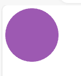

# 图形样式


## 色彩

`fillStyle` 和 `strokeStyle` 分别给图形填充颜色和线条设置颜色。

`fillStyle` | `strokeStyle` = color :CSS 颜色值的字符串

简单示例：

```typescript
fillStyle | strokeStyle = '#2980b9'
```


## 透明度

1.全局设置

```typescript
globalAlpha = value //0.1~1.0的树枝
```

2.单独设置

```typescript
fillStyle | strokeStyle = "rgba(255,0,0,0.5)";
```


## 线条样式

1.线宽

```typescript
lineWidth = value:number
```

2.线条末端样式

```typescript
canvas.lineCap = "butt" | "round" | "square" default=>"butt"

canvas.beginPath();
canvas.moveTo(10,10)
canvas.lineWidth = 10
canvas.lineCap = "round"
canvas.lineTo(210,10);
canvas.stroke()
canvas.closePath()
```


3.定义了在尖角变成斜接时所允许的最大长度，具体来说，当两条线段的相交角度较小时，尖角部分的长度可能会很长，导致图形看起来不自然。为了避免这种情况，`miterLimit` 属性被用来限制尖角的最大长度，如果尖角长度超过了该值，尖角会被截断成斜接，这样可以避免图形的不自然变形。

```typescript
miterLimit = value
```

4.设定线条与线条间接合处的样式。

```typescript
lineJoin = "round" | "bevel" | "miter" default => "miter"

canvas.beginPath();
canvas.lineJoin = "round"
canvas.lineWidth = 10
canvas.moveTo(10,10)
canvas.lineCap = "round"
canvas.lineTo(210,10);
canvas.lineTo(210,210);
canvas.stroke()
canvas.closePath()
```

5.方法返回一个数组，其中包含了当前设置的虚线样式的实线和间隙的长度。如果没有设置虚线样式，则返回一个空数组。

```typescript
const lineDash = context.getLineDash();
```


## 使用渐变

通过创建canvasGradient对象赋值给 `fillStyle` | `strokeStyle` 属性实现渐变

1.线性渐变示例

```typescript
canvas.beginPath();
const lineargradient = canvas.createLinearGradient(0,0,150,150)
lineargradient.addColorStop(0.3,"#1abc9c")
lineargradient.addColorStop(0.6,"#3498db")
lineargradient.addColorStop(0.9,"#8e44ad")
canvas.lineWidth = 10
canvas.lineCap = "round"
canvas.strokeStyle = lineargradient
canvas.moveTo(10,10)
canvas.lineTo(210,10);
canvas.stroke()
canvas.closePath()
```

2.径向渐变示例

```typescript
canvas.beginPath();
canvas.moveTo(400, 400);
const radialgradient = canvas.createRadialGradient(45, 45, 10, 52, 50, 30);
radialgradient.addColorStop(0.2, "#e67e22")
radialgradient.addColorStop(0.4, "#e74c3c")
radialgradient.addColorStop(0.6, "#8e44ad")
radialgradient.addColorStop(0.8, "#27ae60")
radialgradient.addColorStop(1, "#7f8c8d")
canvas.arc(100, 100, 100, 0, Math.PI * 2, true)
canvas.fillStyle = radialgradient
canvas.closePath()
canvas.fill()
```


## 图片填充

```typescript
const el = document.querySelector<HTMLCanvasElement>("canvas")!
const canvas = el.getContext("2d")!

const img = new Image()
img.src = "../images/hubsky.jpg";
img.onload = () => {
    const picturePattern = canvas.createPattern(img,"no-repeat")!;
    canvas.fillStyle = picturePattern;
    canvas.fillRect(0,0,500,500)
}
```


## 图片操作

通过`drawImage()`方法绘制图片,此方法有三张使用方式

假设在html文件中已有一个图片标签

```typescript

```

1.普通绘制

```typescript
const el = document.querySelector<HTMLCanvasElement>("canvas")!
const canvas = el.getContext("2d")!
const img = document.querySelector<HTMLImageElement>("img")!

//按照图片尺寸绘制到canvas中
canvas.drawImage(img,100,100)
```

2.缩放

```typescript
const el = document.querySelector<HTMLCanvasElement>("canvas")!
const canvas = el.getContext("2d")!
const img = document.querySelector<HTMLImageElement>("img")!

//这里通过获取img标签的大小然后缩小一半
canvas.drawImage(img,100,100,img.width / 2,img.height / 2)
```

3.切片

```typescript
const el = document.querySelector<HTMLCanvasElement>("canvas")!
const canvas = el.getContext("2d")!
const img = document.querySelector<HTMLImageElement>("#source")!


canvas.drawImage(img, 100, 100, img.width / 4, img.height / 2 , 100, 100, 600, 504)
```

镂空效果：

```typescript
const img = new Image()

img.src = "../images/hubsky.jpg"
img.onload = () => {
    const pattern = canvas.createPattern(img,"no-repeat");
    canvas.fillStyle = pattern!;
    canvas.fillRect(0,0,img.width,img.height)

    canvas.fillStyle = "rgba(0,0,0,0.4)";
    canvas.fillRect(0,0,img.width,img.height);

    // canvas.globalCompositeOperation = "source-atop";
    canvas.fillStyle = pattern!;
    canvas.fillRect(650,250,400,400);
}
```


## 阴影

通过 `shadowOffsetX` `shadowOffsetY` 设置x,和y方向上的阴影，负值表示向反方向延伸

通过`shadowBlur` `shadowColor` 设置模糊效果和阴影颜色。

最少需要同时设置`shadowOffsetX` `shadowOffsetY` `shadowColor`才能显示阴影

```typescript
canvas.shadowOffsetX = 5
canvas.shadowOffsetY = 10
canvas.shadowBlur = 2;
canvas.shadowColor = "rgba(0, 0, 0, 0.5)";
canvas.fillRect(10, 10, 200, 200)
```


# canvas 填充规则

```typescript
canvas.arc(50, 50, 30, 0, Math.PI * 2, true);
canvas.arc(50, 50, 15, 0, Math.PI * 2, true);
canvas.arc(50, 50, 45, 0, Math.PI * 2, true);
canvas.fillStyle = "#9b59b6"
canvas.fill("nonzero" | "evenodd");
```

效果如下：

1.nonzero



2.evenodd

