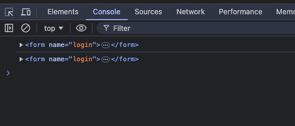

# forwardRef

`forwardRef`允许组件使用`ref` 将DOM元素节点暴露给父组件。

## 语法：

```typescript
const SomeComponent = forwardRef(component)
```

参数：
`component`：函数式组件。

基本示例：

```typescript
import { forwardRef } from 'react';

const MyInput = forwardRef(function MyInput(props, ref) {
  // ...
});
```


## 用法

### 将DOM节点暴露给父组件

在React中，组件的DOM节点都是私有的。但是有时候父组件需要访问和操作子组件的DOM元素。通过使用`forwardRef` 向父组件公开DOM元素。

```typescript
import { forwardRef, useEffect, useRef } from "react";

type IProps = {
  name: string;
};

const FormComponent = forwardRef<HTMLFormElement, IProps>(
  ({ name }: IProps, ref) => {
    return (
      <form ref={ref} name={name}>
        <label htmlFor="name">name:</label>
        <input type="text" id="name" />
      </form>
    );
  }
);

export default () => {
  const formRef = useRef(null);
  
  useEffect(() => {
    console.log(formRef.current);
  }, []);

  return (
    <div>
      <h1>App component</h1>
      <FormComponent name="login" ref={formRef} />
    </div>
  );
};
```

在父组件的`Effect`副作用函数中输出`formRef.current` 时，在控制台输出表单DOM节点，父组件访问到了子组件元素。

