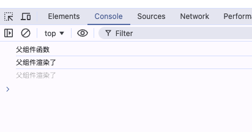

# useMemo

`useMemo` hook 可以在每次重新渲染的时候能够缓存计算的结果。

## 语法

```typescript
const cachedValue = useMemo(calculateValue, dependencies)
```

参数：

+ 计算函数：它应该是一个纯函数，并且不接受任何参数，返回计算的结果并将结果缓存。
+ 依赖项数组：跟`useEffect`差不多的使用方式。


## 跳过代价昂贵的重新计算

假设`filterTodos` 函数是一个花费性能的函数，当组件发生重新渲染的时候，`useMemo` hook的依赖项没有发生改变，则返回上一次计算的结果，减少了函数的重新执行。

```typescript
import { useMemo } from 'react';

function TodoList({ todos, tab, theme }) {
  //组件重新渲染，当props的值没有发生改变的时候使用上一次缓存的值
  const visibleTodos = useMemo(() => filterTodos(todos, tab), [todos, tab]);
  // ...
}
```


## 记忆一个函数

当父组件将一个函数作为`props` 传递给子组件，且当父组件内部的状态发生改变触发重新渲染，这时即使传递给子组件的函数的逻辑并没有改变，也会引起子组件的重新渲染，因为像`function() {}`  或者`() => {}` 这样的函数声明方式，在父组件重新渲染的时候都会返回一个**不同**的函数。

```typescript
import { memo, useState } from "react";

type IProps = {
  handle: any;
};

//子组件已经使用memo函数对组件进行包裹，当props不发生变化时跳过重新渲染
const Comp = memo(({ handle }: IProps) => {
  console.log("子组件渲染了");
  handle();
  return <div>son component</div>;
});

export default () => {
  console.log("父组件渲染了");
  const [count, setCount] = useState<number>(0);

  const addCount = () => {
    setCount((s) => s + 1);
    console.log("父组件函数");
  };
  
  const PasstoSonComp = () => {
    console.log("this is a method pass to son component");
  }
  return (
    <div>
      <h1>App component</h1>
      <p>count:{count}</p>
      <Comp handle={PasstoSonComp} />
      <button onClick={addCount}>add cont</button>
    </div>
  );
};

```

点击父组件的add count 按钮


发现子组件还是发生了重新渲染。 使用`useMemo`hook 记忆函数使子组件跳过重新渲染。

对上面的例子进行修改:

```typescript
import { memo, useMemo, useState } from "react";

...

export default () => {
  ...
  //useMemo hook 记忆化函数
  const PasstoSonComp = useMemo(() => {
    //这里需要返回一个函数
    return () => {
      console.log("this is a method pass to son component");
    };
  },[]);
  
  return (
    <div>
      <h1>App component</h1>
      <p>count:{count}</p>
      <Comp handle={PasstoSonComp} />
      <button onClick={addCount}>add cont</button>
    </div>
  );
};

```

点击addCount 按钮，控制台输出：



只有父组件发生了重新渲染，子组件跳过了重新渲染，实现了减少组件的重渲染。


## 防止频繁的触发Effect

在官网的例子中，当在组件中声明了一个对象：

```typescript
const options = {
  serverUrl: 'https://localhost:1234',
  roomId: roomId
}
```

并且将这个`options`对象作为`useEffect`hook 的依赖的时候

```typescript
useEffect(() => {
  const connection = createConnection(options);
  connection.connect();
  return () => connection.disconnect();
}, [options]);
```

由于对象的声明方式是通过对象字面量的方式声明`{}`，和函数`function(){}`、`() => {}`的声明方式具有相似的行为，在每次组件重新渲染的时候，组件创建的options对象是不一样的（其实是对象的引用地址发生了变化），所以`Effect`副作用函数会被频繁触发。为防止这一行为，使用`useMemo`hook 对 `options`对象进行缓存。

将对`options`的声明修改成如下方式：

```typescript
const options = useMemo(() => {
  return {
    serverUrl: 'https://localhost:1234',
    roomId: roomId
  };
}, [roomId]); 
```

就可以解决频繁触发`Effect`副作用函数的问题。