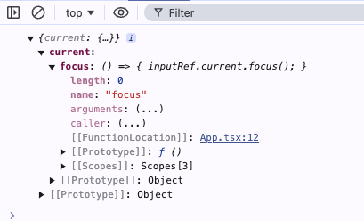

# useImperativeHandle

`useImperativeHandle` 是一个hook，能让你自定义由`ref` 暴露出来的句柄。

句柄，不知道啥意思，大致意思我觉得应该是对 `对象`的引用。

或者说是让父组件可以访问子组件的函数或其他值

语法：

```typescript
useImperativeHandle(ref, createHandle, dependencies?)
```

## 参数

- `createHandle`：该函数无需参数，它返回你想要暴露的 ref 的句柄。该句柄可以包含任何类型。通常，你会返回一个包含你想暴露的方法的对象。
- **可选的** `dependencies`：函数 `createHandle` 代码中所用到的所有反应式的值的列表。具有跟`useEffect`依赖项相似的行为。

## 向父组件暴露一个自定义的ref句柄

默认情况下，组件不会将自身的DOM暴露给父组件，想要在父组件中访问子组件的DOM，需要`forwardRef` api。

在一个父组件中：

```typescript
import { useRef } from "react";

export default () => {
  //通过ref 获取到子组件的引用
  const sonRef = useRef(null);
  return (
    <div>
      <h1>App component</h1>
      <Comp ref={sonRef} />
    </div>
  );
};
```

在子组件中：

```typescript
import {
  forwardRef,
  useImperativeHandle,
  useRef
} from "react";

//通过forwardRef api 获取到父组件传递的ref 对象
const Comp = forwardRef((props, ref) => {
  //假设在子组件中有一个input 元素，如果将ref直接传递给这个元素,那么父组件就可以直接访问到这个元素的DOM节点对象，从而访问这个节点的属性和方法
  return <input ref={ref} />;
});
```

有时候需要限制父组件对子组件元素的访问，而只暴露出一些可调用的函数

```typescript
...
const Comp = forwardRef((props, ref) => {
  //子组件使用useRef操作DOM
  const inputRef = useRef(null)
  //通过useImperativeHandle hook 限制暴露给父组件的句柄
  useImperativeHandle(
    ref,
    () => {
      //这里只暴露了一个方法
      return {
        focus:() => {
          inputRef.current.focus()
        }
      };
    },
    []
  );
  return <input ref={inputRef} />;
});
```

在父组件中打印出父组件的`ref`对象

```typescript
export default () => {
  const sonRef = useRef(null);
  return (
    <div>
      <h1>App component</h1>
      <Comp ref={sonRef} />
      <button onClick={() => console.log(sonRef)}>get Son Ref</button>
    </div>
  );
};
```

可以看到父组件的`ref` 对象的`current`属性包含了子组件暴露出来的`focus`方法



然后在父组件就可以调用这个`focus`函数让子组件的`input`元素 获取到焦点。