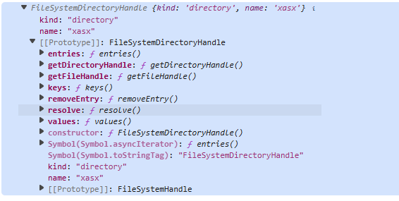

## 文件系统

`文件系统API`提供了`js`访问操作系统文件或目录的`web`接口。允许使用文件读写以及文件管理功能。

此`API`允许程序与用户本地设备的文件系统上的文件进行交互。核心功能包括：

1. 文件读取

   大多数与文件和目录的交互都通过句柄来完成。父类 [`FileSystemHandle`](https://developer.mozilla.org/zh-CN/docs/Web/API/FileSystemHandle) 派生出两个子类：[`FileSystemFileHandle`](https://developer.mozilla.org/zh-CN/docs/Web/API/FileSystemFileHandle) 和 [`FileSystemDirectoryHandle`](https://developer.mozilla.org/zh-CN/docs/Web/API/FileSystemDirectoryHandle)，分别表示文件对象和目录对象。一个对象代表了用户操作系统上的一个文件或目录。

   >句柄:一个**抽象的引用**，用于访问系统资源（如文件、窗口、内存、定时器等），而不是直接暴露底层地址或实现细节。
   >
   >简单理解：一个具有方法的对象（可以是浏览器内置对象或者是自己定义的对象），可以调用这个对象下的某个方法实现某种功能。

   调用接口显示**文件上传**(选择文件)的窗口：

   ```javascript
   const btn = document.querySelector("button");
   const dragUpload = document.querySelector("#file-input");
   
   btn.addEventListener("click", () => {
     showOpenFilePicker().then((file) => {
       //这里得到的是 FileSystemFileHandle 对象而不是 File 对象,调用getFile 异步的得到文件对象
       const target = file.pop().getFile();
   
       target.then((file) => {
         //可以访问到该文件其它信息，如文件名，修改时间等,这里得到的是一个 File 对象
         console.log(file);
       });
     });
   });
   ```

   得到文件句柄的其它方式，如文件拖放`API` 和`getAsFileSystemHandle`方法实现文件拖拽上传。

   ```javascript
   const dragUpload = document.querySelector("div");
   dragUpload.addEventListener("dragover", (e) => {
     // 阻止导航
     e.preventDefault();
   });
   
   dragUpload.addEventListener("drop", async (e) => {
     // 阻止导航
     e.preventDefault();
   
     // 处理所有条目
     for (const item of e.dataTransfer.items) {
       // 对于文件/目录条目，kind 将是“file”
       if (item.kind === "file") {
         const entry = await item.getAsFileSystemHandle();
         console.log(entry);
         if (entry.kind === "file") {
           // 如果条目是文件则运行代码
           entry.getFile().then((file) => {
              //可以访问到该文件其它信息，如文件名，修改时间等,这里得到的是一个 File 对象
             console.log("[ file ] >", file);
           });
         } else if (entry.kind === "directory") {
           // 如果条目是目录则运行代码
         }
       }
     }
   });
   ```

   

2. 写入文件

   使用`FileSystemWritableFileStream`将打开一个写入流将数据保存到文件（可以是已存在的文件或者写入新文件）。

   ```javascript
   import "./style.css";
   
   const btn = document.querySelector("button");
   
   btn.addEventListener("click", () => {
     saveFile();
   });
   
   async function saveFile() {
     // 创建一个新句柄
     const newHandle = await window.showSaveFilePicker();
   
     // 创建一个 FileSystemWritableFileStream 用于写入
     const writableStream = await newHandle.createWritable();
   
     // 写入我们的文件
     await writableStream.write("This is my file content");
   
     // 关闭文件并将内容写入磁盘
     await writableStream.close();
   }
   ```

   此操作会将`This is my file content`写入到一个文件或者你可以新建一个文件并将内容保存到文件中。

3. 访问目录

   访问目录：

   ```javascript
   btn.addEventListener("click", () => {
     showDirectoryPicker().then((FileSystemDirectoryHandle ) => {
         //得到 FileSystemDirectoryHandle 对象
       console.log(FileSystemDirectoryHandle )
     });
   });
   ```

   


#### 其它接口

**`FileSystemObserver`**:提供了一种观察文件变化的机制。

```javascript
import "./style.css";

const btn = document.querySelector("button");

const callback = (records, observer) => {
  for (const record of records) {
    console.log("检测到的变化：", record);
    const reportContent = `观察到的变更为 ${record.changedHandle.kind} ${record.changedHandle.name}。类型：${record.type}。`;
  }

  observer.disconnect();
};

// 观察文件
async function observeFile() {
  const fileHandle = await window.showSaveFilePicker();

  await observer.observe(fileHandle);
}

const observer = new FileSystemObserver(callback);

btn.addEventListener("click", () => {
  observeFile();
});
```

