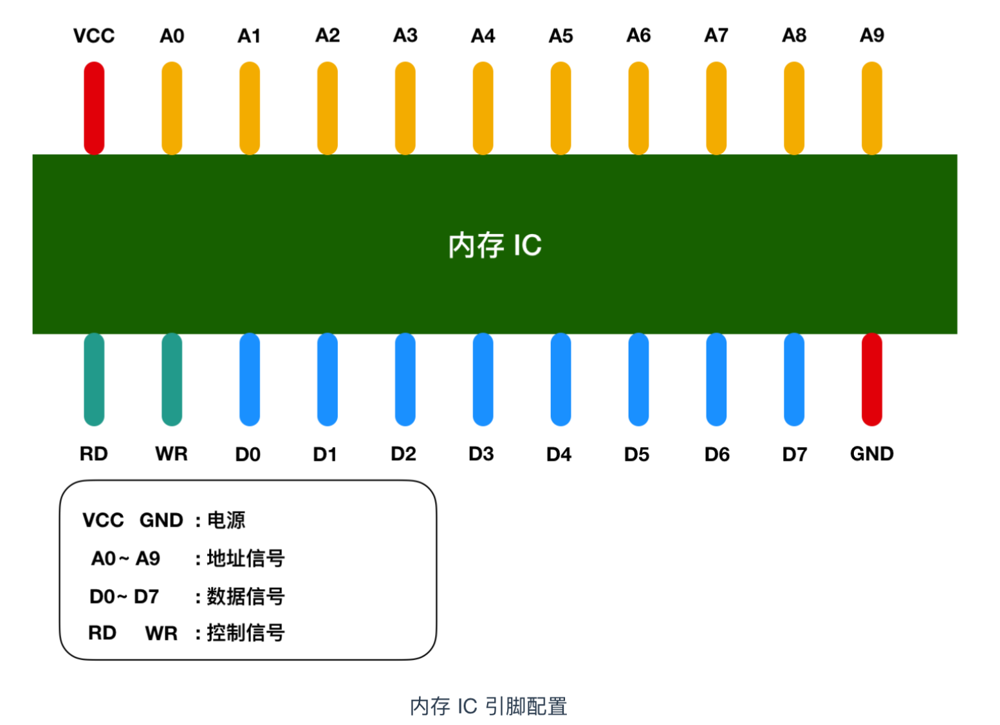
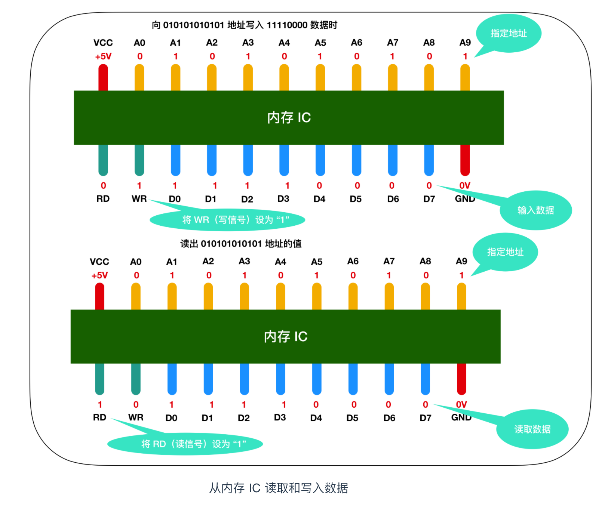
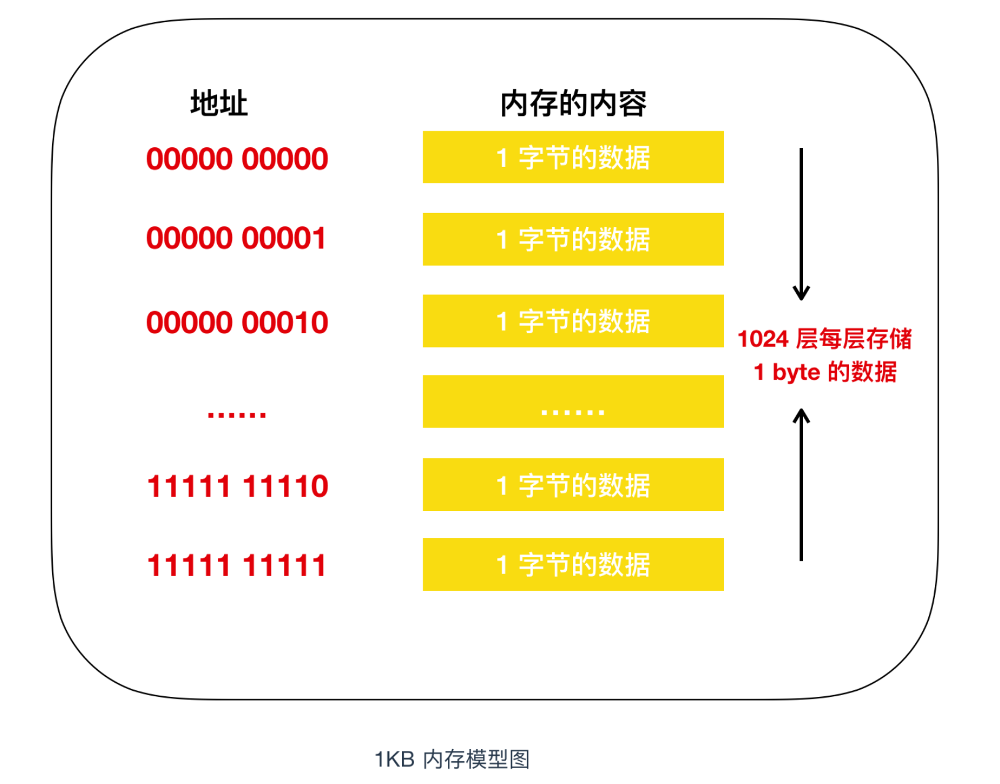

# 内存

`CPU` 和内存就像是一堆不可分割的的恋人一样，是无法拆散的一对儿。没有内存，`CPU`就无法执行程序指令，那么计算机也就失去了意义；只有内存，无法执行指令，那么计算机照样无法运行。

那么什么是内存呢？内存和`CPU`如何进行交互呢？下面就来介绍一下。

### 什么是内存

内存（Memory）是计算机最重要的部件之一，它是程序与`CPU`进行沟通的桥梁。计算机中所有程序的运行都是在内存中进行的，因此内存对计算机的影响非常大，内存又被称为`主存`，其作用是存放`CPU`中的运算数据，以及与硬盘等外部存储交换的数据。只要计算机在运行中，`CPU`就会把需要运算的数据调到主存中进行计算，当运算完成之后再将结果传送出来，主存的运行也决定了计算机的稳定运行。

### 内存的物理结构

内存的内部由各种`IC`电路组成，它的种类很庞大，但是其主要分为三种存储器。

+ 随机存储器`RAM`：内存中最重要的一种，表示既可以从中读取数据，也可以写入数据。当机器关闭时，内存中的信息会`丢失`。
+ 只读存储器`ROM`:`ROM`一般只能用于读取的数据，不能写入数据，但是当机器停电时，这些数据不会丢失。
+ 高速缓存`Cache`：cache 也是我们进程见到的，它分为一级缓存、二级缓存、三级缓存这些数据，它位于内存和`CPU`之间，是一个读写速度比内存`更快`的存储器。当`CPU`向内存写入数据时，这些数据也会被写入高速缓存中，当`CPU`需要读取数据时，会直接从高速缓存中读取，当然，如需要的数据在Cache中没有，`CPU`会再去读取内存中的数据。

内存 IC 是一个完整的结构，它内部也有电源、地址信号、数据信号、控制信号和用于寻址的 IC 引脚来进行数据的读写。下面是一个虚拟的 IC 引脚示意图

图中 VCC 和 GND 表示电源，A0 - A9 是地址信号的引脚，D0 - D7 表示的是控制信号、RD 和 WR 都是好控制信号，我用不同的颜色进行了区分，将电源连接到 VCC 和 GND 后，就可以对其他引脚传递 0 和 1 的信号，大多数情况下，**+5V 表示1，0V 表示 0**。

我们都知道内存是用来存储数据，那么这个内存 IC 中能存储多少数据呢？D0 - D7 表示的是数据信号，也就是说，一次可以输入输出 8 bit = 1 byte 的数据。A0 - A9 是地址信号共十个，表示可以指定 00000 00000 - 11111 11111 共 2 的 10次方 = `1024个地址`。每个地址都会存放 1 byte 的数据，因此我们可以得出内存 IC 的容量就是 1 KB。

### 内存的读写过程

让我们把关注点放在内存 IC 对数据的读写过程上来吧！我们来看一个对内存IC 进行数据写入和读取的模型

来详细描述一下这个过程，假设我们要向内存 IC 中写入 1byte 的数据的话，它的过程是这样的：

- 首先给 VCC 接通 +5V 的电源，给 GND 接通 0V 的电源，使用 `A0 - A9` 来指定数据的存储场所，然后再把数据的值输入给 `D0 - D7` 的数据信号，并把 `WR（write）`的值置为 1，执行完这些操作后，即可以向内存 IC 写入数据
- 读出数据时，只需要通过 A0 - A9 的地址信号指定数据的存储场所，然后再将 RD 的值置为 1 即可。
- 图中的 RD 和 WR 又被称为控制信号。其中当WR 和 RD 都为 0 时，无法进行写入和读取操作。

### 内存的现实模型

为了便于记忆，我们把内存模型映射成为我们现实世界的模型，在现实世界中，内存的模型很想我们生活的楼房。在这个楼房中，1层可以存储一个字节的数据，楼层号就是`地址`，下面是内存和楼层整合的模型图。

我们知道，程序中的数据不仅只有数值，还有`数据类型`的概念，从内存上来看，就是占用内存大小（占用楼层数）的意思。即使物理上强制以 1 个字节为单位来逐一读写数据的内存，在程序中，通过指定其数据类型，也能实现以特定字节数为单位来进行读写。