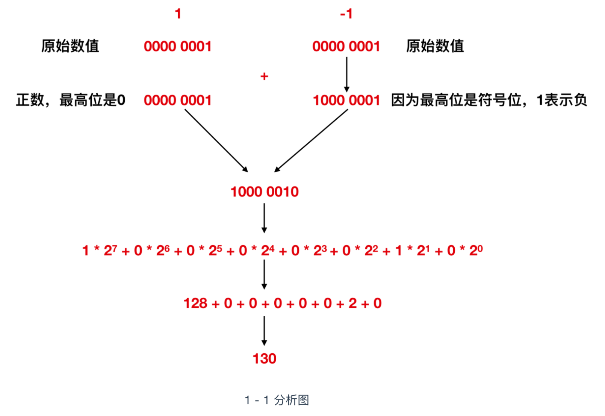

# 二进制

我们都知道，计算机的底层都是使用二进制数据进行数据流传输的，那么为什么会使用二进制表示计算机呢？或者说，什么是二进制数呢？在拓展一步，如何使用二进制进行加减乘除？下面就来看一下。

# 什么是二进制数

那么什么是二进制数呢？为了说明这个问题，我们先把 `00100111` 这个数转换为十进制数看一下，二进制数转换为十进制数，直接将各位置上的值 * 位权即可，那么我们将上面的数值进行转换

也就是说，二进制数代表的 `00100111` 转换成十进制就是 39，这个 39 并不是 3 和 9 两个数字连着写，而是 3 * 10 + 9 * 1，这里面的 `10 , 1` 就是位权，以此类推，上述例子中的位权从高位到低位依次就是 `7 6 5 4 3 2 1 0`。这个位权也叫做次幂，那么最高位就是2的7次幂，2的6次幂 等等。二进制数的运算每次都会以2为底，这个2 指得就是基数，那么十进制数的基数也就是 10 。在任何情况下位权的值都是 **数的位数 - 1**，那么第一位的位权就是 1 - 1 = 0， 第二位的位权就睡是2 - 1 = 1，以此类推。

那么我们所说的二进制数其实就是 用0和1两个数字来表示的数，它的基数为2，它的数值就是每个数的位数 * 位权再求和得到的结果，我们一般来说数值指的就是十进制数，那么它的数值就是 3 * 10 + 9 * 1 = 39。

### 移位运算和乘除的关系

在了解过二进制之后，下面我们来看一下二进制的运算，和十进制数一样，加减乘除也适用于二进制数，只要注意逢 2 进位即可。二进制数的运算，也是计算机程序所特有的运算，因此了解二进制的运算是必须要掌握的。

首先我们来介绍`移位` 运算，移位运算是指将二进制的数值的各个位置上的元素坐左移和右移操作，见下图

#### 补位

刚才我们没有介绍右移的情况，是因为右移之后空出来的高位数值，有 0 和 1 两种形式。要想区分什么时候补0什么时候补1，首先就需要掌握二进制数表示`负数`的方法。

**二进制数中表示负数值时，一般会把最高位作为符号来使用，因此我们把这个最高位当作符号位。** 符号位是 0 时表示`正数`，是 1 时表示 `负数`。那么 -1 用二进制数该如何表示呢？可能很多人会这么认为： 因为 1 的二进制数是 `0000 0001`，最高位是符号位，所以正确的表示 -1 应该是 `1000 0001`，但是这个答案真的对吗？

计算机世界中是没有减法的，计算机在做减法的时候其实就是在做加法，也就是用加法来实现的减法运算。比如 100 - 50 ，其实计算机来看的时候应该是 100 + (-50)，为此，在表示负数的时候就要用到`二进制补数`，补数就是用正数来表示的负数。

为了获得`补数`，我们需要将二进制的各数位的数值全部取反，然后再将结果 + 1 即可，先记住这个结论，下面我们来演示一下。

具体来说，就是需要先获取某个数值的二进制数，然后对二进制数的每一位做取反操作(0 ---> 1 , 1 ---> 0)，最后再对取反后的数 +1 ，这样就完成了补数的获取。

补数的获取，虽然直观上不易理解，但是逻辑上却非常严谨，比如我们来看一下 1 - 1 的这个过程，我们先用上面的这个 `1000 0001`(它是1的补数，不知道的请看上文，正确性先不管，只是用来做一下计算)来表示一下

奇怪，1 - 1 会变成 130 ，而不是0，所以可以得出结论 `1000 0001` 表示 -1 是完全错误的。

那么正确的该如何表示呢？其实我们上面已经给出结果了，那就是 `1111 1111`，来论证一下它的正确性

我们可以看到 1 - 1 其实实际上就是 1 + (-1)，对 -1 进行上面的取反 + 1 后变为 `1111 1111`, 然后与 1 进行加法运算，得到的结果是九位的 `1 0000 0000`，结果发生了`溢出`，计算机会直接忽略掉溢出位，也就是直接抛掉 最高位 1 ，变为 `0000 0000`。也就是 0，结果正确，所以 `1111 1111` 表示的就是 -1 。

**所以负数的二进制表示就是先求其补数，补数的求解过程就是对原始数值的二进制数各位取反，然后将结果 + 1**。

#### 算数右移和逻辑右移的区别

在了解完补数后，我们重新考虑一下右移这个议题，右移在移位后空出来的最高位有两种情况 `0 和 1`。

将二进制数作为带符号的数值进行右移运算时，移位后需要在最高位填充移位前符号位的值( 0 或 1)。这就被称为`算数右移`。如果数值使用补数表示的负数值，那么右移后在空出来的最高位补 1，就可以正确的表示 `1/2,1/4,1/8`等的数值运算。如果是正数，那么直接在空出来的位置补 0 即可。

下面来看一个右移的例子。将 -4 右移两位，来各自看一下移位示意图

如上图所示，在逻辑右移的情况下， -4 右移两位会变成 `63`， 显然不是它的 1/4，所以不能使用逻辑右移，那么算数右移的情况下，右移两位会变为 `-1`，显然是它的 1/4，故而采用算数右移。

那么我们可以得出来一个结论：**左移时，无论是图形还是数值，移位后，只需要将低位补 0 即可；右移时，需要根据情况判断是逻辑右移还是算数右移。**

下面介绍一下符号扩展：**将数据进行符号扩展是为了产生一个位数加倍、但数值大小不变的结果，以满足有些指令对操作数位数的要求，例如倍长于除数的被除数，再如将数据位数加长以减少计算过程中的误差。**

以8位二进制为例，符号扩展就是指在保持值不变的前提下将其转换成为16位和32位的二进制数。将`0111 1111`这个正的 8位二进制数转换成为 16位二进制数时，很容易就能够得出`0000 0000 0111 1111`这个正确的结果，但是像 `1111 1111`这样的补数来表示的数值，该如何处理？直接将其表示成为`1111 1111 1111 1111`就可以了。也就是说，不管正数还是补数表示的负数，只需要将 0 和 1 填充高位即可。
