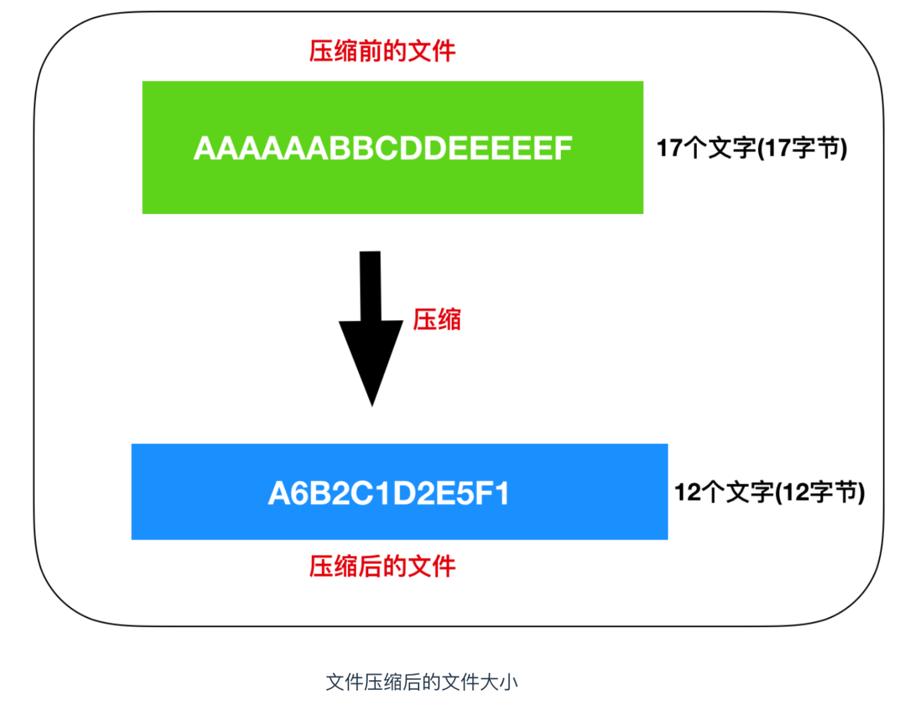
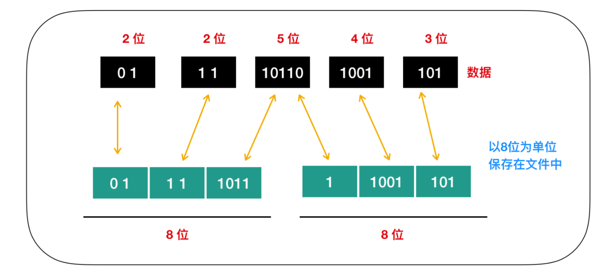
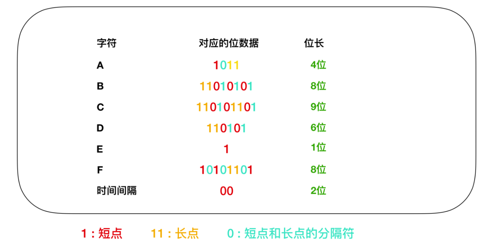
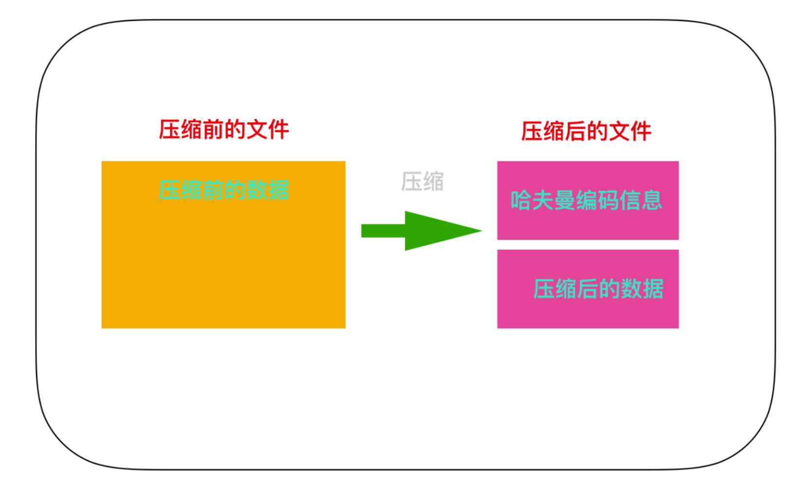
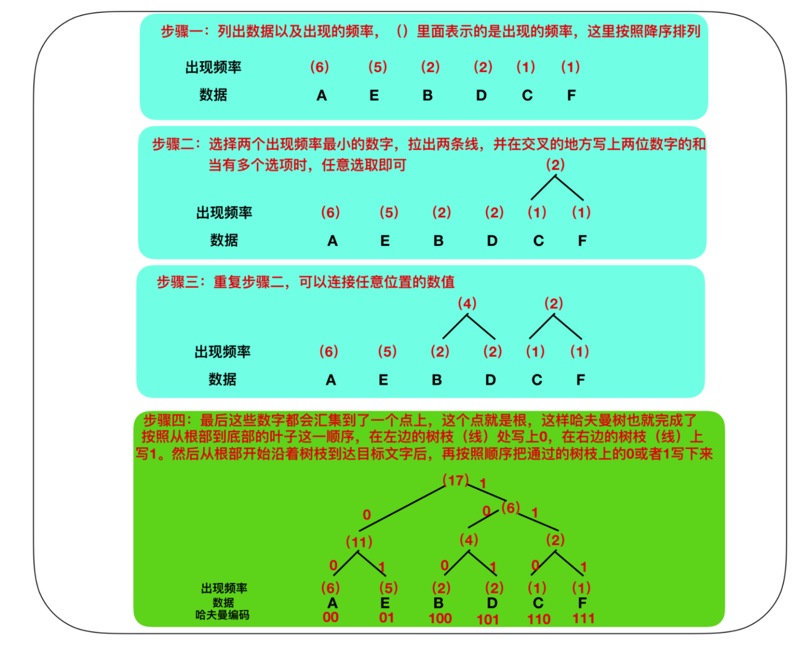
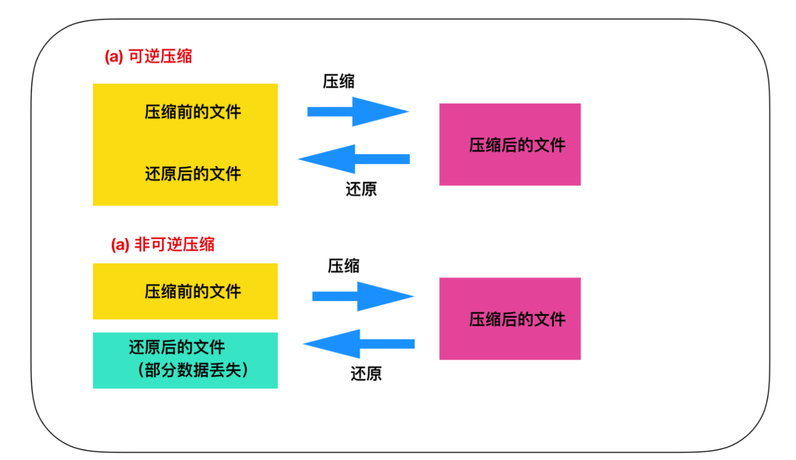

# 压缩算法

我们想必都有过`压缩`和 `解压缩`文件的经历，当文件太大时，我们会使用文件压缩来降低文件的占用空间。比如微信上传文件的限制是100 MB，我这里有个文件夹无法上传，但是我解压完成后的文件一定会小于 100 MB，那么我的文件就可以上传了。

此外，我们把相机拍完的照片保存到计算机上的时候，也会使用压缩算法进行文件压缩，文件压缩的格式一般是`JPEG`。

那么什么是压缩算法呢？压缩算法又是怎么定义的呢？在认识算法之前我们需要先了解一下文件是如何存储的。

## 文件存储

文件是将数据存储在磁盘等存储媒介的一种形式。程序文件中最基本的存储数据单位是`字节`。文件的大小不管是 xxxKB、xxxMB等来表示，就是因为文件是以字节 `B = Byte` 为单位来存储的。

文件就是字节数据的集合。用 1 字节（8 位）表示的字节数据有 256 种，用二进制表示的话就是 0000 0000 - 1111 1111 。如果文件中存储的数据是文字，那么该文件就是文本文件。如果是图形，那么该文件就是图像文件。在任何情况下，文件中的字节数都是`连续存储`的。

## 压缩算法的定义

上面介绍了文件的集合体其实就是一堆字节数据的集合，那么我们就可以来给压缩算法下一个定义。

`压缩算法（compaction algorithm）`指的就是数据压缩的算法，主要包括压缩和还原（解压缩）的两个步骤。

其实就是在不改变原有文件属性的前提下，降低文件字节空间和占用空间的一种算法。

根据压缩算法的定义，我们可将其分成不同的类型：

**有损和无损**

无损压缩：能够`无失真地`从压缩后的数据重构，准确地还原原始数据。可用于对数据的准确性要求严格的场合，如可执行文件和普通文件的压缩、磁盘的压缩，也可用于多媒体数据的压缩。该方法的压缩比较小。如差分编码、RLE、Huffman编码、LZW编码、算术编码。

有损压缩：有失真，`不能完全准确地`恢复原始数据，重构的数据只是原始数据的一个近似。可用于对数据的准确性要求不高的场合，如多媒体数据的压缩。该方法的压缩比较大。例如预测编码、音感编码、分形压缩、小波压缩、JPEG/MPEG。

**对称性**

如果编解码算法的复杂性和所需时间差不多，则为对称的编码方法，多数压缩算法都是对称的。但也有不对称的，一般是编码难而解码容易，如 Huffman 编码和分形编码。但用于密码学的编码方法则相反，是编码容易，而解码则非常难。

**帧间与帧内**

在视频编码中会同时用到帧内与帧间的编码方法，帧内编码是指在一帧图像内独立完成的编码方法，同静态图像的编码，如 JPEG；而帧间编码则需要参照前后帧才能进行编解码，并在编码过程中考虑对帧之间的时间冗余的压缩，如 MPEG。

**实时性**

在有些多媒体的应用场合，需要实时处理或传输数据（如现场的数字录音和录影、播放MP3/RM/VCD/DVD、视频/音频点播、网络现场直播、可视电话、视频会议），编解码一般要求延时 ≤50 ms。这就需要简单/快速/高效的算法和高速/复杂的CPU/DSP芯片。

**分级处理**

有些压缩算法可以同时处理不同分辨率、不同传输速率、不同质量水平的多媒体数据，如JPEG2000、MPEG-2/4。

这些概念有些抽象，主要是为了让大家了解一下压缩算法的分类，下面我们就对具体的几种常用的压缩算法来分析一下它的特点和优劣。

### 集中常见压缩算法的理解

**RLE 算法的机制**

接下来就让我们正式看一下文件的压缩机制。首先让我们来尝试对 `AAAAAABBCDDEEEEEF` 这 17 个半角字符的文件（文本文件）进行压缩。虽然这些文字没有什么实际意义，但是很适合用来描述 `RLE` 的压缩机制。

由于半角字符（其实就是英文字符）是作为 1 个字节保存在文件中的，所以上述的文件的大小就是 17 字节。如图

那么，如何才能压缩该文件呢？大家不妨也考虑一下，只要是能够使文件小于 17 字节，我们可以使用任何压缩算法。

最显而易见的一种压缩方式我觉得你已经想到了，就是把相同的字符`去重化`，也就是 `字符 * 重复次数` 的方式进行压缩。所以上面文件压缩后就会变成下面这样

从图中我们可以看出，**AAAAAABBCDDEEEEEF** 的17个字符成功被压缩成了 **A6B2C1D2E5F1** 的12个字符，也就是 12 / 17 = 70%，压缩比为 70%，压缩成功了。

像这样，把文件内容用 `数据 * 重复次数` 的形式来表示的压缩方法成为 `RLE(Run Length Encoding, 行程长度编码)` 算法。RLE 算法是一种很好的压缩方法，经常用于压缩传真的图像等。因为图像文件的本质也是字节数据的集合体，所以可以用 RLE 算法进行压缩

**哈夫曼算法和莫尔斯编码**

下面我们来介绍另外一种压缩算法，即哈夫曼算法。在了解哈夫曼算法之前，你必须舍弃`半角英文数字的1个字符是1个字节(8位)的数据`。下面我们就来认识一下哈夫曼算法的基本思想。

文本文件是由不同类型的字符组合而成的，而且不同字符出现的次数也是不一样的。例如，在某个文本文件中，A 出现了 100次左右，Q仅仅用到了 3 次，类似这样的情况很常见。哈夫曼算法的关键就在于 **多次出现的数据用小于 8 位的字节数表示，不常用的数据则可以使用超过 8 位的字节数表示**。A 和 Q 都用 8 位来表示时，原文件的大小就是 100次 * 8 位 + 3次 * 8 位 = 824位，假设 A 用 2 位，Q 用 10 位来表示就是 2 * 100 + 3 * 10 = 230 位。

> 不过要注意一点，最终磁盘的存储都是以8位为一个字节来保存文件的。

哈夫曼算法比较复杂，在深入了解之前我们先吃点`甜品`，了解一下 `莫尔斯编码`，你一定看过美剧或者战争片的电影，在战争中的通信经常采用莫尔斯编码来传递信息，例如下面

接下来我们来讲解一下莫尔斯编码，下面是莫尔斯编码的`示例`，大家把 1 看作是短点(嘀)，把 11 看作是长点(嗒)即可。

莫尔斯编码一般把文本中出现最高频率的字符用`短编码` 来表示。如表所示，假如表示短点的位是 1，表示长点的位是 11 的话，那么 E（嘀）这一数据的字符就可以用 1 来表示，C（滴答滴答）就可以用 9 位的 `110101101`来表示。在实际的莫尔斯编码中，如果短点的长度是 1 ，长点的长度就是 3，短点和长点的间隔就是1。这里的长度指的就是声音的长度。比如我们想用上面的 AAAAAABBCDDEEEEEF 例子来用莫尔斯编码重写，在莫尔斯曼编码中，各个字符之间需要加入表示时间间隔的符号。这里我们用 00 加以区分。

所以，AAAAAABBCDDEEEEEF 这个文本就变为了 A * 6 次 + B * 2次 + C * 1次 + D * 2次 + E * 5次 + F * 1次 + 字符间隔 * 16 = 4 位 * 6次 + 8 位 * 2次 + 9 位 * 1 次 + 6位 * 2次 + 1位 * 5次 + 8 位 * 1次 + 2位 * 16次 = 106位 = 14字节。

**所以使用莫尔斯电码的压缩比为 14 / 17 = 82%**。效率并不太突出。

**用二叉树实现哈夫曼算法**

刚才已经提到，莫尔斯编码是根据日常文本中各字符的出现频率来决定表示各字符的编码数据长度的。不过，在该编码体系中，对 AAAAAABBCDDEEEEEF 这种文本来说并不是效率最高的。

下面我们来看一下哈夫曼算法。哈夫曼算法是指，为各压缩对象文件分别构造最佳的编码体系，并以该编码体系为基础来进行压缩。因此，用什么样的编码（哈夫曼编码）对数据进行分割，就要由各个文件而定。用哈夫曼算法压缩过的文件中，存储着哈夫曼编码信息和压缩过的数据。

接下来，我们在对 AAAAAABBCDDEEEEEF 中的 A - F 这些字符，按照`出现频率高的字符用尽量少的位数编码来表示`这一原则进行整理。按照出现频率从高到低的顺序整理后，结果如下，同时也列出了编码方案。

| 字符 | 出现频率 | 编码（方案） | 位数 |
| :--: | :------: | :----------: | :--: |
|  A   |    6     |      0       |  1   |
|  E   |    5     |      1       |  1   |
|  B   |    2     |      10      |  2   |
|  D   |    2     |      11      |  2   |
|  C   |    1     |     100      |  3   |
|  F   |    1     |     101      |  3   |

在上表的编码方案中，随着出现频率的降低，字符编码信息的数据位数也在逐渐增加，从最开始的 1位、2位依次增加到3位。不过这个编码体系是存在问题的，你不知道100这个3位的编码，它的意思是用 1、0、0这三个编码来表示 E、A、A 呢？还是用10、0来表示 B、A 呢？还是用100来表示 C 呢。

而在哈夫曼算法中，通过借助哈夫曼树的构造编码体系，即使在不使用字符区分符号的情况下，也可以构建能够明确进行区分的编码体系。不过哈夫曼树的算法要比较复杂，下面是一个哈夫曼树的构造过程。

自然界树的从根开始生叶的，而哈夫曼树则是叶生枝。

**哈夫曼树能够提升压缩比率**

使用哈夫曼树之后，出现频率越高的数据所占用的位数越少，这也是哈夫曼树的核心思想。通过上图的步骤二可以看出，枝条连接数据时，我们是从出现频率较低的数据开始的。这就意味着出现频率低的数据到达根部的枝条也越多。而枝条越多则意味着编码的位数随之增加。

接下来我们来看一下哈夫曼树的压缩比率，用上图得到的数据表示 AAAAAABBCDDEEEEEF 为 000000000000 100100 110 101101 0101010101 111，40位 = 5 字节。压缩前的数据是 17 字节，压缩后的数据竟然达到了惊人的5 字节，也就是压缩比率 = 5 / 17 = 29% 如此高的压缩率，简直是太惊艳了。

大家可以参考一下，无论哪种类型的数据，都可以用哈夫曼树作为压缩算法

| 文件类型 |  压缩前   |  压缩后  | 压缩比率 |
| :------: | :-------: | :------: | :------: |
| 文本文件 | 14862字节 | 4119字节 |   28%    |
| 图像文件 | 96062字节 | 9456字节 |   10%    |
| EXE文件  | 24576字节 | 4652字节 |   19%    |

**可逆压缩和非可逆压缩**

最后，我们来看一下图像文件的数据形式。图像文件的使用目的通常是把图像数据输出到显示器、打印机等设备上。常用的图像格式有 : `BMP`、`JPEG`、`TIFF`、`GIF` 格式等。

- BMP ： 是使用 Windows 自带的画笔来做成的一种图像形式
- JPEG：是数码相机等常用的一种图像数据形式
- TIFF: 是一种通过在文件中包含"标签"就能够快速显示出数据性质的图像形式
- GIF： 是由美国开发的一种数据形式，要求色数不超过 256个

图像文件可以使用前面介绍的 `RLE 算法`和`哈夫曼算法`，因为图像文件在多数情况下并不要求数据需要还原到和压缩之前一摸一样的状态，允许丢失一部分数据。我们把能还原到压缩前状态的压缩称为 `可逆压缩`，无法还原到压缩前状态的压缩称为`非可逆压缩` 。

一般来说，`JPEG`格式的文件是非可逆压缩，因此还原后有部分图像信息比较模糊。`GIF` 是可逆压缩