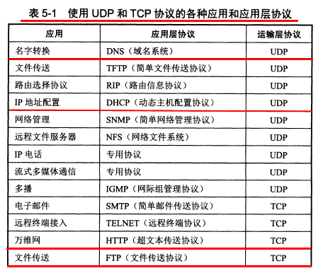

# 传输层

## 5.1 运输层协议概述

**5.1.1 进程之间的通信**

网络层为主机之间提供通信，运输层为**应用进程**提供**端到端**的逻辑通信。

通信的真正端点是**主机中的进程**，即应用进程之间的通信是端到端的通信。

**运输层的复用和分用**

即发送方的**不同进程通过不同的端口号使用同一个运输层协议**，接收方的运输层则把收到的报文根据端口号分发给不同的进程。

**5.1.2 运输层的两个主要协议**

运输层的两个主要协议是 **传输控制协议 `TCP`** 和 **用户数据报协议 `UDP`**，他们都有复用和分用，和检错的功能。

**`UDP` 的特点**：无连接、尽最大努力交付、面向报文、无拥塞控制、支持一对一、一对多、多对一、多对多，首部开销小。

**`TCP` 的特点：**面向连接的、点对点通信、提供可靠传输、全双工通信、面向字节流。

**UDP**

接收方的主机收到 `UDP` 后不需要发出确认。

**TCP**

TCP 传送数据前要建立连接，传送完成后要释放连接。

TCP 不提供广播或多播服务。

因为 TCP 的功能较多，所以首部很长，且占用处理器资源。

**5.1.3 运输层的端口**

运输层使用 16 位（即两字节）端口号来标志一个端口。端口号用来标志本计算机应用层中的不同进程。不同计算机间的端口没有关联。

这里的端口是软件端口，作为交互的地址使用，不同于路由器上的硬件端口。

**端口号的分配**

运输层的端口号分为**服务器端**使用的端口号和**客户端**使用的端口号。

服务器端的端口号包括 `0~49151`，其中 `0~1023` 是**熟知端口号**（又称系统端口号），剩下的是登记端口号。

客户端使用的端口号包括 `49152~65535`。这些端口号是给某个客户进程暂时使用的，通信结束后端口号就要恢复未分配状态。

## 5.2 用户数据报协议`UDP`

**5.2.1 `UDP`概述**

`UDP` 的特点：无连接、尽最大努力交付**、**面向报文**、**无拥塞控制、支持一对一、一对多、多对一、多对多，首部开销小。

**5.2.2 `UDP`的首部格式**

`UDP` 的首部总共 8 个字节，只有四个字段：源端口、目的端口、长度、检验和。

如果接收方发现报文中的目的端口号不对，就丢弃报文，并使用 `ICMP` 发送“端口不可达”差错报文给发送方。`ICMP` 的应用 `tracert` 就是使用了 `UDP` 报文。

因为 `UDP` 的通信之间是无连接的，所以虽然要用到端口号，但是不用`套接字`（TCP 必须要在套接字之间建立连接）。

`UDP` 的`检验和`用来检验整个 `UDP` 报文的差错。

**`UDP` 的差错检验方法**是各个 4 字节段的反码求和，和作为检验和序列放入检验和字段。检验时对数据报各个 4 字节段反码求和，若每一位都是 1 则无错。

这种差错检验方法的检错能力不强，但是处理起来快。

## 5.3 传输控制协议TCP概述

**5.3.1 TCP最主要的特点**

TCP 的特点：面向连接的、点对点通信、提供可靠传输、全双工通信、面向字节流。

1. 面向连接：使用 TCP 前要先建立连接，通信完后要释放连接。
2. 点对点通信。
3. 可靠传输：无差错、不丢失、无重复、按序到达。
4. 全双工通信：TCP 的两端都设有发送缓存和接收缓存。发送时，应用程序把数据放到 TCP 的发送缓存后，TCP 在合适的时候把数据发送出去。接收时，TCP 把收到的数据放入接收缓存，应用进程合适时读取缓存中的数据。
5. 面向字节流：流是流入到进程或从进程流出的字节序列。TCP 把应用进程交下来的数据看成一串无结构的字节流。

TCP 的**报文长度**是根据接收窗口和网络拥塞程度决定。如果应用进程一次往发送缓存中放了很长的数据，那 TCP 可能会把它划分为多个短的数据块发送，如果应用进程一次只发来一个字节，TCP 也可以等积累足够多的字节后再把它们构成报文段发出去。

**5.3.2 TCP的连接**

**`IP` 地址加上端口号**称为**套接字**，套接字就是 TCP 连接的端点。

套接字不是应用进程，也不是端口。

套接字的格式： `IP`地址：端口号（如 `192.168.100.2：80`）

每一条 TCP 连接唯一地被它地两个端点的套接字所确定。

## 5.4 可靠传输的工作原理

**5.4.1 停止等待协议**

**停止等待协议**用来**在不可靠的传输网络上**实现可靠通信。

原理：每发送完一个分组就停止发送，等待对方的确认，收到确认后再发送下一个分组。分组需要进行编号。

**出现差错**

如果发送方发送的数据在传输过程丢失了，或者到达了接收方但是报文内容出了差错，那么接收方都不会发送任何信息。这时发送方超时没有收到确认，就会进行重传。

**超时重传**是超过一定时间没收到确认就要重传刚发送过的分组。实现方式是每发送完一个分组就设置一个超时计时器，重传时间比平均往返时间长一些，这又称**自动重传请求 ARQ**。

这里要注意：

1. 发送方在发送完一个分组后，必须暂时保留已发送的分组的副本，以在超时重传时使用，只有收到相应的确认后才能清除保留的副本（对照发送缓存和发送窗口的后沿来理解）
2. 分组和确认分组都需要进行编号，以明确是哪个分组收到了确认，哪个没有收到（对照 TCP 报文首部中的序号和确认号来理解）。
3. 超时计时器的重传时间要比平均往返时间长一些，具体重传时间设为多少是一个很复杂的问题。

**确认丢失和确认迟到**

如果接收方发送给发送方的确认丢失或迟到了，那么发送方超时未收到确认，也会进行重传。而接收方收到重传的报文后，会丢弃这个重复的报文，并向发送方发送确认。发送方收到了重复的确认会直接丢弃。

若对方收到重复分组，就丢弃该分组，同时还要发送确认。接收方收到重复的确认后不做任何操作。

**提高信道利用率**

停止等待协议的信道利用率很低，为了提高效率，采用了流水线传输方式，这用到了**连续 ARQ 协议**和**滑动窗口协议**

流水线传输就是发送方可以连续发送多个分组，而不必每发完一个分组都要停下来等待对方的确认。

**5.4.2 连续`ARQ`协议**

连续 `ARQ` 协议用来提高利用率，它规定：

1. 发送方维持一个**发送窗口**，凡位于发送窗口内的分组都可以连续发送出去，而不需要等待对方确认。发送方每收到一个确认，就根据确认号将发送窗口向前滑动一定距离。
2. 接收方采用**累积确认**：不必对收到的分组逐个发送确认，而是只需对按序到达的最后一个分组发送确认，表明这个分组以前的所有分组都正确收到。

由上可见，连续 `ARQ` 协议是在滑动窗口上实现的。滑动窗口协议是 TCP 协议的精髓。

## 5.5 TCP报文段的首部格式

TCP 传输的数据单元是报文段，一个 TCP 报文段分为首部和数据两部分。

TCP 报文段首部的前 20 个字节是固定的，后面有 4N 个字节是按需增加的选项。

首部各字段的作用：

1. **序号**：在一个 TCP 连接中传送的字节流中的每一个字节都要按顺序编号。首部中的序号字段存储本报文段发送的**数据**（是数据，不包含首部）的第一个字节的序号。序号字段只有 32 位，序号值不能超过 $2^{32}$。

   理解：数据部分的每个字节都会占用一个序号。(首部的序号字段存储的是字节流中的第一个字节的序号)

3. **确认号**：首部中的确认号是期望收到对方下一个报文端的第一个数据字节的序号。**若确认号为 N，表明到 N-1 为止的数据都已正确收到。**

4. **数据偏移**：数据部分距报文起始点的偏移，实际等于首部长度。首部长度在 20~60 字节之间。

5. 保留。保留为今后使用。

6. **6个控制位：**

7. 1. 紧急 URG：当 URG=1，此报文段需要尽快传送，优先级高。
   2. 确认 ACK：当 ACK=1，确认号字段有效。**连接建立后的所有报文段都必须令 ACK=1**。
   3. 推送 PSH：当 PSH=1，接收方收到报文后尽快交付应用进程，而非等缓存满了再交付。
   4. 复位 RST：当 RST=1，表明 TCP 连接中出现严重差错，需要释放连接再重新建立连接。
   5. 同步 SYN：**当 SYN=1，表明这个一个连接报文**。如果 ACK=0 则是连接请求报文，如果 ACK=1 表明这是连接接受报文。
   6. 终止 FIN：当 **FIN=1，表明发送方已发送完数据，并要求释放连接**。

8. **窗口**：窗口指的是发送本报文段的一方的接收窗口。首部中的窗口字段指出了从本报文段中的确认号算起，**当前允许对方发送的数据量**（以字节为单位）。

9. **检验和**：检验整个数据报。

10. **紧急指针**，当 URG=1 时才有意义，指出本报文段中的紧急数据的字节数。即使在窗口为 0 时也可以发送紧急数据。

11. **选项**：长度可变，最长 40 字节。选项有**最大报文段长度 MSS**、窗口扩大选项、时间戳选项、选择确认选项等。

**最大报文段长度 MSS**

最大报文段长度 MSS 是每一个 TCP 报文段中的数据字段的最大长度，而不是整个 TCP 报文段的最大长度。

MSS 并不是一个标准固定值，而是可以由连接双方各自确定的值，且两个传送方向可以有不同的 MSS 值。MSS 的值可能达到几千字节。

连接建立时，双方都把自己支持的 MSS 写入这个选项字段中，以后就按照这个值传送数据。

如果未填写这一选项，那么 MSS 的默认值是 536 字节长。

**窗口扩大选项**

TCP 中窗口字段长度是 16 位，因此最大的窗口大小是 64K 字节。但是对于卫星网络，因为传播时延和带宽都很大，为了获得高吞吐率就需要更大的窗口。

**时间戳选项**

时间戳选项字段中包括时间戳值字段和时间戳回送回答字段。

时间戳选项用来计算往返时间 RTT。发送方把发送报文时的时间放入时间戳字段，接收方在确认该报文时把时间戳字段值复制到它的时间戳回送回答字段中。这样发送方收到确认报文后就可以计算出 RTT 来。

另一方面时间戳选项还可以用来防止序号绕回，因为 TCP 序号字段只有 32 位，序号值不能超过 $2^{32}$，所以可能出现具有相同序号的报文段，时间戳可以用来区分这样的报文段。

## 5.6 TCP可靠传输的实现

**5.6.1 以字节为单位的滑动窗口**

滑动窗口是以字节为单位的，每个字节都有序号。

**TCP 使用滑动窗口机制。发送窗口里的序号表示允许发送的序号，发送窗口后沿的后面部分表示已发送且已收到了确认，发送窗口前沿的前面部分表示不允许发送。发送窗口的前沿会不断向前移动（也可能不动或后移），发送窗口的后沿可能不动（没有收到新的确认）也可能前移（收到了新的确认），不可能后移**。

接收方会把接收窗口的值放到窗口字段中发给发送方，发送窗口的大小不能超过接收方传来的报文首部中的窗口字段值。

接收方**发回的确认号是自己按序收到的数据的最高序号加1**。

发送方会根据接收方发来的确认号和窗口字段来构造自己的发送窗口，确认号决定了发送窗口的后沿，窗口字段值和拥塞窗口共同决定发送窗口的大小。

发送窗口中的数据是可以直接连续发送出去的，所以发送窗口越大，可能获得的传输效率越高。

**一个使用滑动窗口进行可靠传输的例子**

A 为发送方，B 为接收方。

例子的开始时，A 根据 B 发来的窗口值（20）和确认号（31）构建了自己的发送窗口，如上图所示。此时发送窗口内的数据都是允许发送但尚未发送的数据。

现在 A 发送了 11 个字节的数据（序号 31-41），如下图所示。此时发送窗口内的数据包含已发送但未收到确认（P1~P2）的数据和允许发送但尚未发送的数据（P2~P3）两部分。

这时发送窗口的状态需要三个指针来描述：P1 指向发送窗口的后沿，P2 指向允许发送但尚未发送的第一个字节，P3 指向发送窗口的前沿外即将进入发送窗口的字节。P2~P3 之间的部分又称可用窗口。

然后 B 收到了序号为 32，33 的数据，但是没有收到序号为 31 的数据，因为 B 只对按序收到的数据中的最高序号进行确认，所以此时 B 发送给 A 的确认报文段中确认号仍为 31。

接下来 B 收到了序号为 31 的数据，并把 31~33 的数据交付给应用进程，然后删除了这些数据。B 的接收窗口也向前移动了 3 个序号，同时给 A 发送确认号为 34 的确认报文。

A 收到确认号为 33 的报文后，也将发送窗口向前滑动了 3 个序号，此时发送窗口大小没变，但是可用窗口变大了。

接下来 A 继续把可用窗口中的数据发送完后，P2 指针向前移动和 P3 重合，此时 A 的可用窗口已减小到 0，要暂时停止发送，等待收到确认。

如果 A 超时未收到确认报文，就重传这部分数据，直到收到 B 的确认报文为止。

**发送缓存**

发送方维持一个**发送缓存**(数据副本)，其中存放

1. 准备发送的数据。
2. 已经发送但尚未收到确认的数据。

**发送窗口是发送缓存的一部分。**已被确认的的数据会被从发送缓存中删除，因此发送缓存和发送窗口的后沿是重合的。

应用进程向发送缓存写入数据时不能太快，否则填满发送缓冲后就没有存放数据的空间了。

实际发送/接收缓存和窗口中的字节数是非常大的。

**接收缓存**

接收方维持一个**接收缓存**，用来存放：

1. 按序到达的、尚未被接收应用程序读取的数据。
2. 未按序到达的数据。

接收窗口是接收缓存的一部分。如果应用程序来不及读取收到的数据，接收缓存就会被填满，使接收窗口减小到 0，反之接收窗口会增大，但最大不能超过接收缓存的大小。

TCP 没有明确规定如何处理未按序到达的数据，但通常是先临时存放在接收窗口中，等字节流中缺少的字节到达后，再交付给上层的应用进程。

**累积确认**

TCP 要求接收方必须有累积确认的功能，这样可以减小传输开销。

接收方可以在合适的时候发送确认，也可以在自己有数据要发送时把确认信息捎带上。

但是注意接收方不能过分推迟发送确认，以避免发送方产生不必要的重传。如果收到一连串具有最大长度的报文段，则必须每隔一个报文段就发送一个确认。

TCP 的通信是全双工通信。通信中每一方都在发送和接收报文段，因此每一方都有自己的发送窗口和接收窗口。

**5.6.2 超时重传时间的选择**

重传时间的选择是 TCP 最复杂的问题之一。

因为 TCP 的报文可能只在一个高速局域网中传送，也可能要经过多个低速率的网络，所以重传时间不能设为固定值。

TCP 采用了一种自适应算法，它依据**往返时间 RTT** 来设置超时重传时间。

TCP 保留了一个 **历史 RTT 的加权平均结果** RTTs。

RTTs 的计算方式：新的 RTTs = (1-a)*旧的 RTTs + a*新的RTT。a 建议取 0.125。

**超时重传时间 RTO** 比 RTTs 略大：RTO = RTTs + 4*RTTd。

RTTd 是 RTT 的偏差的加权平均值：新的 RTTd = (1-b)*旧的 RTTd + b*|RTTs - 新的RTT|。b 建议取 0.25。

**具体实现**

要解决当报文重传的特殊情况。

实现方式：报文段每重传一次，就把 RTO 增加一倍，当不重传了，就继续使用上述公式计算 RTO。

**5.6.3 选择确认SACK**

当报文未按序到达（到达的字节不连续，一段一段的），发送方需要重传收到的确认号之后的所有报文，而有些确认号之后的不连续的报文实际上已经到了，全部重传会浪费资源。**选择确认**用来解决这种情况。

首部的选项中可以有选择确认 SACK 字段。SACK 使用两个字节块分别指明一个连续字段的开始位置和长度。最多可以指出 4 个连续字节块的边界情况。

SACK 应用不多。

## 5.7 TCP的流量控制

**流量控制**是为了让发送方的发送速率不要太快，要让接收方来得及接收。

**5.7.1 利用滑动窗口实现流量控制**

流量控制是通过滑动窗口实现的。接收方会把**接收窗口的大小放到给发送方的报文的窗口字段中**。

发送方的发送窗口不能超过接收方给出的窗口字段的数值。

**死锁**

当接收方的接收窗口减小到 0，发送方停止发送数据后。过了一段时间 B 的接收窗口恢复了一些，但是它发给发送方的报文丢失了，然后 A 就会一直等待 B 发送的非零窗口的通知，而 B 也一直等待 A 发送的数据，这时就进入了死锁状态。

死锁的解决：TCP 每一个连接都设有一个持续计时器。只要 TCP 连接的一方收到对方的零窗口通知，就启动持续计时器。若持续计时器的时间到期，就发送一个零窗口探测报文段，对方则在返回这个探测报文段的确认报文时给出窗口值。

**5.7.2 TCP的传输效率**

应用进程把数据传送到 TCP 的发送缓存后，剩下的发送任务就交给 TCP 来完成了。

**Nagle 算法**

TCP 的实现中广泛使用了 **Nagle 算法**：

1. 发送方先把到达发送缓存的第一个数据字节发送出去，收到确认后，再把发送缓存中剩下的数据组装成报文段发送。
2. 收到前一个报文段的确认后再发送下一个报文段。
3. 当缓存中的数据达到发送窗口的一半大小或报文段最大长度后，就立即发送一个报文段。

Nagle 算法用来避免发送方发送很小的报文段。

## 5.8 TCP的拥塞控制

**5.8.1 拥塞控制的一般原理**

**拥塞**就是当前对网络中某一资源的需求超过了该资源所能提供的可用部分，网络性能变坏。

概括而言拥塞的条件就是：对资源的需求 > 可用资源。

网络拥塞的成因往往十分复杂，并拥塞常常趋于恶化。比如因为网络拥塞有报文未能按时到达，那么发送方就会超时重传使更多的分组进入网络，加剧网络拥塞。

**拥塞控制就是防止过多的数据注入到网络中，**使网络中的路由器或链路不致过载。

流量控制是**端到端的问题**，是接收端抑制发送端发送数据的速率。拥塞控制是**全局性的问题**，涉及到所有的主机、路由器及相关因素。

TCP 连接的端点只要迟迟收不到对方的确认信息，就猜想网络中某处可能出现了拥塞。

**5.8.2 TCP的拥塞控制方法**

TCP 的拥塞控制采取了**慢开始、拥塞避免、快重传、快恢复**四种算法。

这种方法是**基于窗口的拥塞控制**。发送方维持一个**拥塞窗口**，并让自己的发送窗口等于拥塞窗口（实际上发送窗口取拥塞窗口和接收窗口中的较小者）。

控制拥塞窗口的原则是：只要网络中没有出现拥塞，就把拥塞窗口增大一些；但只要网络出现拥塞或可能出现了拥塞，就把拥塞窗口减小一些。

判断网络拥塞的依据是**出现超时**。当出现拥塞就使拥塞窗口减小，反之增大。

**慢开始**

初始拥塞窗口很小，然后由小到大逐渐增大发送窗口。

初始拥塞窗口一般不超过 2-4 个 SMSS（发送方最大报文段）长度。每收到一个新的确认后，就增加一次拥塞窗口。

使用慢开始算法，每经过一个传输轮次，拥塞窗口 cwnd 就会加倍。

**拥塞避免**

拥塞避免算法是让拥塞窗口缓慢地增大，不像慢开始那样加倍增长。

当 cwnd 大于一个界限值时，就使用拥塞避免算法，小于时就使用慢开始算法。

当出现超时，拥塞窗口就恢复初始值重新进行慢开始，且界限值减半。

**快重传**

快重传要求当接收方收到报文段后立即发送确认。

当接收方收到的报文段出现丢失，它后面不论收到什么报文段，发回的确认号都是对失序之前的那个报文段的确认。

当发送方**连续收到 3 个对同一报文段的重复确认**（表明下一个报文段未收到），就立即重传下一个报文段，这样就可以避免超时。

这是为了避免出现超时，使发送方误判为网络拥塞。

**快恢复**

对于一般的超时，界限值减半，拥塞窗口直接置为初始值；对于快重传情况下，界限值减半，拥塞窗口设置为和界限值一样，以实现快恢复。

发送方的发送窗口实际设置为**接收方窗口 rwnd 和拥塞窗口 cwnd 中较小的一个**。

**5.8.3 主动队列管理AQM**

在**网络层**，路由器可以通过采用**主动队列管理 AQM** 来减少网络拥塞的发生。

主动队列管理就是路由器采取的一种分组丢弃策略。

路由器的队列中的分组是先进先出，在队列满了之后到达的分组就直接丢弃。

主动队列管理就是在队列长度还未满时就丢弃后面的分组。但是具体丢弃策略尚未标准化。

## 5.9 TCP的运输连接管理

TCP 连接有三个阶段：连接建立、数据传送、连接释放。

主动发起 TCP 连接的应用进程是客户，另一方是服务器。

TCP 的连接开始前客户和服务器都会创建一个**传输控制块 TCB**，其中存储如 TCP 连接表、指向发送/接收缓存的指针、指向重传队列的指针等。连接释放后删除。

**5.9.1 TCP的连接建立**

TCP 的连接采用**三次握手机制：服务器要确认客户的连接请求，客户要对服务器的确认进行确认。**

**连接请求报文**和**连接接受报文**段都不能携带数据，但是都消耗一个序号。

第三个 **ACK 报文**段可以携带数据也可以不携带，若不携带则不消耗序号（即下一个报文序号和此报文序号相同）。

SYN-SENT 表示同步已发送状态，SYN-RCVD 表示同步收到状态，ESTABLISHED 表示已连接状态。

TCP 有如下规定：

1. SYN = 1 的报文段都不能携带数据，但要消耗掉一个序号。所以三次握手中前两个报文都不能携带数据。
2. ACK = 1 的报文段如果不携带数据则不消耗序号。

三报文握手中的第二个报文，也就是服务器发给客户的 SYN 报文也可以拆分成两个报文段，一个确认报文段（ACK = 1, ack = x+1）和一个同步报文段（SYN = 1, seq = y），那样就是四报文握手了。 

**采用三报文握手是为了解决客户发送的连接请求报文中途滞留发生重传的情况。**当发生重传情况，客户可能连续发送了两个连接请求，而服务器也会回复两个连接接受，此时发送端通过最后一个确认报文保证只建立一个连接。

如果不采用三报文握手，那么只要服务器发出确认，新的连接就建立了。

**5.9.2 TCP的连接释放**

TCP 的连接释放采用**四次挥手机制**。**任何一方**都可以在数据传送结束后发出连接释放的通知，等待对方确认后进入半关闭状态。当另一方也没有数据发送后，则发送连接释放通知，对方确认后完全关闭 TCP 连接。

上图中客户发起了**连接释放报文(FIN=1)**，此时不再传送数据。但是服务器可能还要传送数据，因此在发送一个 **ACK 报文**后，如果有数据传送还要继续发送完。

**当服务器发送完数据，就发送连接释放报文，接着客户端对此确认，服务器收到确认后彻底关闭连接。**

TCP 规定：FIN 报文即使不携带数据，也要消耗一个序号。

**四次挥手的详细流程**

1. A 向 B 发送连接释放报文（FIN 报文）后进入 FIN-WAIT-1（终止等待1）状态。
2. B 收到连接释放报文后立即发出确认，然后 B 就进入了 CLOSE-WAIT（关闭等待）状态。TCP 服务器进程这时要通知高层应用进程，从 A 到 B 方向的连接已经释放了，TCP 连接实际上已经是半关闭状态。
3. A 收到 B 的确认后，就进入 FIN-WAIT-2（终止等待2）状态，等待 B 发出的连接释放报文段。
4. B 在发送确认报文后，如果没有数据要发送，应用进程就通知 TCP 释放连接，这时 B 会发送连接释放报文（FIN 报文）。如果 B 还要发送数据，就等发送完数据后再发送连接释放报文。这之后 B 进入 LAST-ACK（最后确认）状态
5. A 收到 B 的连接释放报文后，要再发送一个确认报文段（ACK 报文），然后进入 TIME-WAIT（时间等待）状态。A 会在这一状态保持 2MSL 的时间（这里有一个时间等待计时器），之后进入 CLOSED 状态。
6. B 收到 A 的确认报文后也会进入 CLOSED 状态。B 会比 A 更早地结束连接。

MSL 含义是最长报文段寿命，RFC 标注建议是 2 分钟，实际一般小于等于 2 分钟，因此 TIME-WAIT 的时长一般小于等于 4 分钟。

**TIME-WAIT 状态的意义**

1. 保证 A 发送的最后一个 ACK 报文段能够到达 B。这个 ACK 报文段可能丢失，当 B 没有收到 A 的 ACK 报文，会超时重传它之前发送的连接释放报文，这样 A 就能在 2MSL 时间内收到 B 重传的 FIN 报文，然后 A 重传 ACK 报文，并重新启动 2MSL 计时器。

2. 1. 如果没有 TIME-WAIT 状态，而是发完 ACK 报文后就立即释放连接，就无法收到 B 重传的 FIN 报文段，这样 B 就无法正常进入 CLOSED 状态。

3. 防止已失效的报文遗留到下一个连接中，经过 2MSL 在关闭连接可以使本连接产生的所有报文都从网络中消失。

**保活计时器**

保活计时器：TCP 还会设置一个保活计时器。如果客户发生故障，服务器不再收到客户发来地数据，可以通过保活计时器来避免服务器白白等待。

保活计时器的工作方式：服务器每收到一次客户的数据，就重新设置保活计时器，通常是 2 小时。如果 2h 每收到客户数据，服务器就发送一个探测报文段，之后每隔 75s 发送一次。如果连续发送 10 个探测报文后客户仍没有响应，服务器就认为客户端出了故障，关闭当前的 TCP 连接。

**TIME_WAIT**

客户端在发送最后一个确认报文后不能直接进入 CLOSED 状态，要等待 **2MSL** 的时间（一般小于2分钟）。这是为了**保证它发送的确认报文能够到达服务器**。如果未能及时到达，服务器会超时重传连接释放报文，客户就会重新发送确认，并重新计时。另外也是保证本次连接产生的所有报文都从网络中消失。

**5.9.3 TCP的有限状态机**

下面的状态机中虚线表示的是服务器进程的状态变迁，实线表示的是客户进程的状态变迁。

