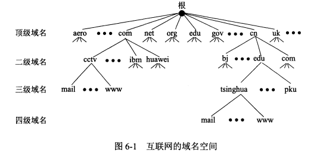
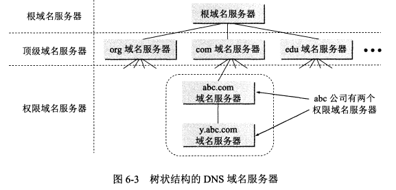
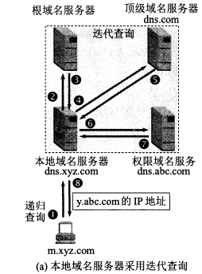
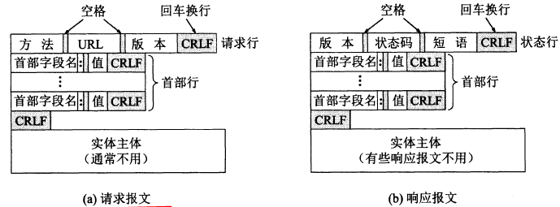
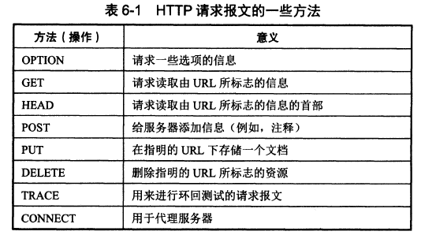
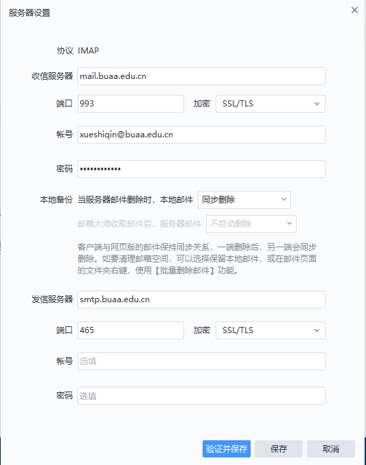
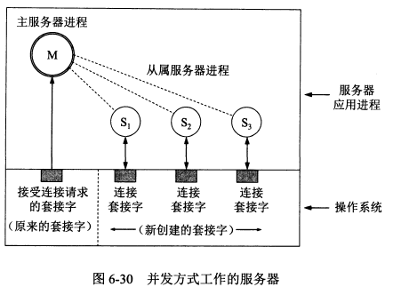
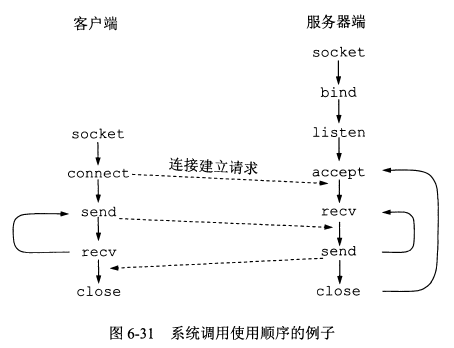

# 应用层

应用层的协议多是基于客户-服务器方式。这里的客户和服务器都是**应用进程**。

应用层协议规定了**应用进程**通信时遵循的协议。

## 6.1 域名系统DNS

**6.1.1 域名系统概述**

**域名系统 `DNS`** 是互联网使用的**命名系统**，用来**把便于识别的名字转换为 `IP` 地址**。

`DNS` 是一个**联机分布数据库系统**，采用客户-服务器方式。

`DNS` 使大多数名字在本地进行解析，只有少量解析要在互联网上通信。

域名到 `IP` 地址的解析是由互联网上的**许多域名服务器共同完成的**。

**域名到 `IP` 地址的解析过程：**

1. 当某一应用进程需要解析域名，就调用解析程序，成为 DNS 的一个客户，**把待解析的域名放到 DNS 请求报文中，以 UDP 用户数据报**方式发给**本地域名服务器**。本地域名服务器查找域名后把对应的 IP 地址发给该应用进程。应用进程**获得 IP 地址后即可进行通信**。
2. 如果本地域名服务器不能回答该请求，就向其他域名服务器请求，此时它就成为了客户。

**6.1.2 互联网的域名结构**

互联网采用层次树状结构的命名方法，任何一台连接在互联网上的**主机**或**路由器**都有唯一一个域名。

如以下两个网站采用了不同的四级域名：

1. `www.buaa.edu.cn`  ：北航主页
2. `yzb.buaa.edu.cn`  ：北航研招办

**域名由标号序列组成，最右边的标号是顶级域名，往左依次降低。**

域名中的标号只能由**英文字母、数字和 ‘-’** 组成，**不区分大小写字母**。完整域名不超过 255 个字符。

各级域名由其上一级的域名管理机构管理，顶级域名由 `ICANN` 管理。

顶级域名 TLD 包括：

1. **国家顶级域名**：**cn 为中国**，us 为美国，uk 为英国。

2. **通用顶级域名**：**com(公司企业), net(网络服务机构), org(非营利性组织), int(国际组织)**, edu(美国教育机构), gov(美国政府部门), mil(美国军事部门)。

3. 1. 上面是最初的 7 个顶级域名，后面还增加了很多其他的。现在已经有了中文的顶级域名。

4. 基础结构域名：arpa，用于反向域名解析。

我国的二级域名分为两类：

1. 类别域名：**com(企业)**, ac(科研机构), **edu**, **gov**, mil, net, org 等。
2. 行政区域名：适用于各省。如 bj 为北京。

**6.1.3 域名服务器**

**域名服务器**分为**根域名服务器**、**顶级域名服务器**、**权限域名服务器**和**本地域名服务器**。

1. 所有的根域名服务器都**包含所有的顶级域名服务器的域名和IP地址。**

2. 1. 根域名服务器是最重要的服务器，如果本地域名服务器无法解析域名，**首先求助于根域名服务器**。
   2. 根域名服务器在全球有成百上千个，但是分布是很不均衡的。
   3. 根域名服务器使用了**任播技术**。

3. 顶级域名服务器：管理在该服务器注册的二级域名。

4. 权限域名服务器：负责一个区的应服务器

5. **本地域名服务器**：主机查询域名时首先询问本地域名服务器，**计算机属性中的 DNS 服务器就是本地域名服务器**。

域名解析过程中主机向本地域名服务器的查询是递归查询。

本地域名服务器向根域名服务器的查询是迭代查询，即当根域名服务器无法完成解析时，就把下一步应该查询的域名服务器告诉本地域名服务器。

为提高查询效率，域名服务器中采用了**高速缓存**，存放最近查询过的域名信息。

## 6.2 文件传送协议

**6.2.1 FTP概述**

**文件传送协议 FTP** 使用 **TCP** 的可靠运输服务，为客户-服务器模式。

**简单文件传送协议 `TFTP`** 使用 **`UDP`** 协议。

`FTP` 和 `TFTP` 都属于文件共享协议中的一大类：**复制整个文件**。特点是要存取一个文件，就必须先获得一个本地的文件副本。要修改文件，只能对文件副本进行修改，然后将修改后的文件副本传送回到原节点。

**6.2.2 FTP的基本工作原理**

FTP 主要功能是减少或消除在不同操作系统下处理文件的不兼容性。

**FTP 的服务器进程**

一个 FTP 服务器进程可以同时为多个客户进程提供服务。

FTP 的服务器进程包括**一个主进程和若干个从属进程：**

1. 主进程：负责接受新的请求。当主进程收到客户进程发来的连接请求后，将其交给从属进程进行处理。然后回到等待状态继续接受其他客户的请求。
2. 从属进程：负责处理单个请求。

服务器进程中的主进程和从属进程是并发执行的。

**文件传输功能的实现**

文件传输时，FTP 的客户和服务器之间会建立**两个并行的 TCP 连接：控制连接和数据连接**，其中数据连接用于传输文件。因此 **FTP 要使用两个端口号**。

两个连接对应服务器端的两个从属进程：控制进程和数据传送进程。

FTP 客户发送的传送请求通过控制连接发送给控制进程。然后**控制进程创建数据传送进程和数据连接**。

**6.2.3 简单文件传送协议TFTP**

简单文件传送协议 TFTP 使用 UDP 协议。

TFTP 的主要优点是可用于 UDP 环境，代码简便。

TFTP 采用了类似**停止等待协议**的**重传机制**。即发送后就等待确认，没有确认就重传。

## 6.3 远程终端协议TELNET

**远程终端协议 TELNET** 采用客户服务器模型。能**将客户端的操作传到服务器端，然后将服务器端的输出返回到客户端屏幕**。

`TELNET` 采用 `TCP` 协议。

**TELNET 的服务器进程**

`TELNET` 的服务器进程类似 `FTP`，由主进程等待新的请求，并产生从属进程来处理每一个连接。

## 6.4 万维网www

**6.4.1 万维网概述**

万维网 WWW 是**一个大规模的、联机式的信息储藏所**。万维网的简称是 **Web**。

**超文本**指的是**包含指向其他文档的链接的文本**，一个超文本由多个信息源链接组成。超文本仅包含文本信息，超媒体扩充为包含图形、声音、视频等。

万维网是一个分布式的超媒体系统。

Web 的客户程序向互联网中的服务器程序发出请求，服务器程序向客户程序送回客户所要的万维网文档。

页面就是在客户程序主窗口显示出的万维网窗口。

**Web 要处理的几个问题及解决方式：**

1. 如何标志分布在整个互联网上的**文档**：采用**统一资源定位符 URL**。
2. 用什么协议来实现万维网上的链接：采用**超文本传送协议 HTTP**。
3. 怎么实现创作不同风格的万维网文档：使用**超文本标记语言 HTML**。
4. 怎样使用户很方便地找到所需信息：通过搜索引擎实现。

**6.4.2 统一资源定位符URL**

万维网使用统一资源定位符 URL 来标志万维网上的各种文档，**每个文档有在互联网内唯一的 URL**。

URL 相当于指向互联网上任何可访问对象的一个指针。

URL 的一般形式：**<协议>://<主机>:<端口>/<路径>**

1. 协议：指出采用何种协议来获取该万维网文档，一般为 http，其次为 ftp
2. 主机：即该主机的域名。
3. **端口：通常都省略掉**，HTTP 的默认端口号是 **80**。
4. 路径：有时可省略。

输入 URL 时协议和 www 都可以省略，浏览器会自动补上。

**使用 HTTP 的 URL**

HTTP 的默认端口号是 80，通常都省略掉了。

**当路径也省略掉，则 URL 指向互联网上的某个主页**，比如 http://www.buaa.edu.cn。

主页可以是：

1. 一个 WWW 服务器的最高级别的页面。
2. 某一个组织的一个定制的页面，从这个页面可以链接到本组织的其他站点。
3. 个人设计的 WWW 页面。

https://www.buaa.edu.cn/jgsz1/yxsz.htm 左边是一个 URL 链接，cn/ 右侧的为路径，最后的 .htm 表明这是一个 html 文档

**6.4.3 超文本传送协议HTTP**

HTTP 是**面向事务**的应用层协议。**事务**指的是一系列的不可分割的信息交换（即这些信息交换是一个整体）。

万维网客户与服务器程序之间交互使用的协议是 HTTP 协议。万维网的客户就是浏览器

HTTP 本身是**无连接、无状态**的，使用可靠传输的 **TCP 协议**。

1. 无连接：通信双方在交换 http 报文前不需要先建立 http 连接。
2. **无状态**：HTTP 服务器不记得曾经访问过的客户。

**HTTP连接的建立与释放**

每个万维网网点都有一个服务器进程，它不断地监听 TCP 的端口 **80**，当发现有浏览器向它发来 TCP 的连接建立请求并建立连接后，浏览器就会发出浏览某个页面的请求，服务器接着返回所请求的页面作为响应。最后 TCP 连接释放。

注意这个过程：**首先建立 TCP 连接**，且该连接的**端口为 80**。客户会**把 HTTP 请求报文作为 TCP 连接三次握手中的第三个报文的数据**。然后服务器直接返回文档作为响应。

**HTTP/1.1**

HTTP/1.1 协议使用了**持续连接**。就是万维网服务器在发送响应后一段时间内仍保持这条连接，当客户继续访问时不需要重新建立 TCP 连接。

HTTP/1.1 协议的持续连接有两种工作方式：

1. 非流水线方式：客户收到前一个响应后才能发下一个请求。
2. 流水线方式：客户收到上一个响应前就可以接着发新的请求。

**代理服务器**

**代理服务器**又称**万维网高速缓存**，它把最近的一些请求和响应暂存在本地磁盘中。当新请求与暂存的请求相同，就返回暂存的响应。

代理服务器可以在客户端或服务端工作，也可以在中间系统上工作。

比如某个校园网使用了代理服务器，当校园网中某个主机的浏览器请求服务时，先和代理服务器建立 TCP 连接并发出 HTTP 请求报文，如果代理服务器有所请求对象就返回这个对象，如果没有，代理服务器就代表用户与源点服务器建立连接并发送 HTTP 请求报文。 

**HTTP 的报文结构**

HTTP 报文的每一个字段都是 **ASCII 码串**。

HTTP 有请求报文和响应报文两类报文。

HTTP 报文由三部分组成：

1. **开始行**：用于区分是请求报文还是响应报文。

2. 1. **请求行**：包括方法（表明了请求报文的类型），**请求的 URL**，HTTP 的版本。
   2. 状态行：响应报文的第一行叫状态行，包括：HTTP 的版本，**状态码**，解释状态码的短语。

3. 首部行：用来说明浏览器、服务器或报文主体的一些信息。

4. 实体主体：请求报文一般不使用这个字段，响应报文可能会使用。

注意：HTTP 报文中，**请求行最后有一个 CRLF**，**其他所有首部之间也都有一个 CRLF**，**首部与实体主体之间有两个 CRLF**。

一个 HTTP 请求报文的例子：

> GET /dir/index.htm HTTP/1.1   //请求行，这里使用了相对 URL
> Host:www.buaa.edu.cn          //第一个首部行，给出了主机的域名
> Connection:close              //告诉服务器发送完请求的文档后就可以释放连接。
> User-Agent:Mozilla/5.0        //表明用户代理使用了火狐浏览器
> Accept-Launguage:cn           //表明用户希望优先收到中文版本的文档
> //请求报文的最后还有一个空行

**HTTP 请求报文的一些方法**

**HTTP 响应报文的** **5 大类状态码：**

1. 1xx。表示通知信息，如请求收到了或正在处理。
2. 2xx。表示成功。
3. 3xx。表示重定向，如要完成请求还需要采取进一步的行动。如 HTTP/1.1 301 Moved Permanently。这时后面还会跟一个首部行表明新的 URL 地址：Location:http://www.buaa.edu.cn/dd/index.html
4. 4xx。表示客户的差错。如 Http/1.1 404 Not Found
5. 5xx。表示服务器的差错。

**在服务器上存放用户的信息**

HTTP 是无状态的。当有时想要保存一些信息，比如保存某网站的账号与密码，就需要采用 **Cookie 技术**。**万维网站点可以使用 Cookie 来跟踪用户**。

Cookie 的工作原理：当用户 A 浏览某网站，该网站的服务器就为 A 产生一个唯一的识别码，并存储在数据库中，接着在给 A 的响应报文中添加一个字段名为 Set-cookie，值为识别码的首部行，A 收到此响应报文后把它存储在自己的 Cookie 文件中。这样服务器就能够知道用户 A 什么时候访问了哪些页面。当 A 之后再次访问时，服务器可以识别出 A，这样就不需要用户 A 再次输入姓名，密码等。

**6.4.4 万维网的文档**

万维网使用超文本标记语言 HTML 来显示各种万维网页面。

HTML 文档是一种可以使用任何文本编辑器创建的 **ASCII 码文件**。

HTML 文档一般以 .html 或 .htm 为后缀。

HTML 规定了链接的设置方法。链接一般显示为蓝色字且加上下划线，链接的终点是其他页面。

当链接指向的是本计算机中的文件，就是**本地链接**。

**其他语言**

**可扩展标记语言 XML** 和 HTML 很相似。但从设计宗旨而言，**XML 用于传输数据**，而 **HTML 用于显示数据**。

**可扩展超文本标记语言 XHTML** 是作为一种 XML 应用被重新定义的 HTML，将逐步取代 HTML。

**层叠样式表 CSS** 是一种样式表语言，用于为 HTML 文档定义布局。如规定在浏览器上显示的字体、颜色、边距等。

**静态文档**

万维网**静态文档**：文档创作完毕后就存放在万维网服务器中，在用户浏览过程中，内容不会变。

**动态文档**

**动态文档：**文档的内容是在浏览器访问万维网服务器时由应用程序动态创建的。每次访问用户看到的内容都是不一样的。(比如说php动态生成的html页面)

比如天气预报、股市行情等都要用动态文档。

动态文档和静态文档的差别主要在服务器一端。

通用网关接口 CGI 是一种标准，定义了动态文档如何创建。服务器端使用 **CGI 程序**来创建动态文档。

**脚本**指的是**被另一个程序而非处理器来解释或执行的程序**。JavaScript 等就是脚本语言。

:::info

CGI（**Common Gateway Interface** ，通用网关接口）是一种标准协议，用于**Web服务器与外部程序之间的通信接口** 。它允许 Web 服务器将客户端（如浏览器）的请求转发给一个外部程序（称为 **CGI程序** ），再将程序的输出结果返回给客户端。

#### 什么是 CGI 程序？

CGI 程序是一个**可执行程序** 或脚本，通常**运行在服务器上**，用来生成动态网页内容。它可以是任何语言编写的程序，比如：

- Shell 脚本（bash）
- Perl
- Python
- PHP（早期版本常用 CGI 模式）
- C/C++ 编译后的二进制文件

CGI 程序接收来自 Web 服务器的数据（例如 HTTP 请求参数、环境变量等），处理后输出 HTML 或其他格式的内容，供浏览器显示。

:::

**活动文档**

**活动文档**：可以使浏览器屏幕连续更新。

当浏览器请求一个活动文档，服务器直接返回**一段活动文档程序的副本**，使该程序副本在浏览器端运行。活动文档程序可以与用户直接交互，并可以连续地改变屏幕的显示。

**6.4.5 万维网的信息检索系统**

搜索引擎是在万维网中进行搜索的工具，可以分为全文搜索引擎（百度、谷歌等）和分类目录搜索引擎（搜狐、新浪等门户网站）两大类。

全文检索搜索引擎的工作原理：通过搜索软件（如爬虫程序）到各网站搜集信息，像蜘蛛爬行一样从一个网站连接到另一个网站，然后建立一个在线索引数据库。当用户查询时，就从已经建立的索引数据库中进行查询。

**Google 搜索技术的特点**

Google 的核心技术是 PageRank，即**网页排名**。

将搜索结构根据重要性排名。关键字频率、是否知名网站等都会影响重要性。

## 6.5 电子邮件

**6.5.1 电子邮件概述**

电子邮件系统包括三个主要构件：**用户代理**、**邮件服务器**、**邮件协议**（包括**邮件发送协议**和**邮件读取协议**）。

用户代理就是电脑上的邮件客户端。

从用户代理把邮件发送到邮件服务器，以及邮件服务器之间的传送都要使用 **SMTP 协议**。用户代理从邮件服务器读取邮件时则使用 **POP3 或 IMAP 协议**。

**发送邮件的过程**

用户代理使用 SMTP 协议把邮件发给`发送方邮件服务器`，然后`发送方邮件服务器`与`接收方邮件服务器`建立 TCP 连接并把邮件发送过去，邮件不会在某个中间服务器落地。收件人收信时，使用 POP3 协议从`接收方邮件服务器`读取邮件。

一个邮箱地址的格式是：用户名@邮件服务器的域名，如 dhb@buaa.edu.cn。

**6.5.2 简单邮件传送协议SMTP**

SMTP 采用客户-服务器模式。

发件人的邮件会存在发送方邮件服务器的邮件缓存中，发送方邮件服务器（此时它是 SMTP 客户）定期扫描邮件缓存，如果有邮件就与接收方邮件服务器建立连接并发送过去。

SMTP 的熟知端口是 **25**。

SMTP 发送的是明文，不利于保密；发送邮件不需要鉴别，方便了垃圾文件的泛滥。新出的扩展的 SMTP 即 **ESMTP** 对这些进行了改进。

**6.5.3 电子邮件的信息格式**

略。

**6.5.4 邮件读取协议POP3和IMAP**

常用的邮件读取协议有 `POP3` 和 `IMAP`。

**`POP3`**

`POP3` 采用客户-服务器模式，它非常简单、但功能有限。`POP3` 的特点是只要用户从 `POP3` 服务器读取了邮件，服务器就把该邮件删除。

**`IMAP`**

`IMAP4` 也采用客户-服务器模式，但是复杂地多。`IMAP4` 是一个联机协议，用户在自己计算机上就可以操纵邮件服务器的邮箱。

用户打开邮件时，邮件才传到用户的计算机上。用户未主动删除邮件前，`IMAP` 服务器邮箱中的邮件就一直保存着。

`IMAP` 的缺点是如果用户没有将邮件复制到自己计算机上，每次查阅邮件都必须上网。

**网易邮箱大师中的服务器设置**

**6.5.5 基于万维网的电子邮件**

基于万维网的电子邮件即用户使用浏览器收发电子邮件，这种情况用户浏览器和邮件服务器之间的传送使用 HTTP 协议，邮件服务器之间的传送仍使用 `SMTP` 协议。

万维网电子邮件不需要在计算机中安装用户代理软件。

**6.5.6 通用互联网邮件扩充MIME**

SMTP 只能传送 **ASCII 码**，不能传送非英语文字，也不能传送可执行文件等。

**通用互联网邮件扩充 MIME** 对 SMTP 进行了扩充，它定义了传送非 ASCII 码的编码规则。

网络中传送的还是 ASCII 码，MIME **采用一些编码方式来用 ASCII 码表示其他字符**。

MIME 指定了几百上千种可传送的文件类型，这些类型涵盖了常用的各种文件类型。

## 6.6 动态主机配置协议`DHCP`

因为 `IP` 地址中包含了网络号，而计算机第一次使用前不知道它会连到哪个网络，所以无法在出厂前就设置好 `IP` 地址。

当计算机的 `IP` 地址发生变化，比如计算机到了一个新的网络中，就要**使用动态主机配置协议 `DHCP` 来配置 `IP` 地址**，通过 `DHCP` 可以实现即插即用联网，而不需要人工配置 `IP` 地址。

**配置 IP 地址的方法**

DHCP 采用了客户-服务器模式。

**需要配置 IP 地址的主机**启动时就**向 `DHCP 服务器`广播发送发现报文。DHCP 收到后会给该计算机发送一个提供报文来提供分配的 IP 地址。**

响应 DHCP 客户的 DHCP 服务器可能有多个，客户只会从中选择一个给其发送请求报文。

每个网络至少有一个 **`DHCP` 中继代理**（一般是一个路由器），用来做主机与 `DHCP` 服务器之间的中转。\

:::info

**DHCP 中继代理（DHCP Relay Agent）** 是一种网络设备或功能，用于在不同子网之间转发 **DHCP 请求和响应** 。它的主要作用是：**让一个 DHCP 服务器能够为多个子网中的客户端分配 IP 地址** 。

:::

DHCP 服务器分配的地址有一个**租用期限制**。可能是几小时也可能是几年。当接近租用期了 DHCP 会请求更新租用期。

DHCP 客户的熟知端口是 **68**，DHCP 服务器的熟知端口是 **67**。

当一个手机从连接到一个新的 wifi 时，就要通过 DHCP 来获取新的 IP 地址。

## 6.7 简单网络管理协议`SNMP`

**6.7.1 网络管理的基本概念**

**网络管理**包括对硬件、软件和人力的使用、综合和协调。

在一个网络管理系统中会有一个管理者和许多被管设备。被管设备可能是主机、路由器、集线器等。

每个被管设备中都要运行一个网络管理代理程序。代理程序在管理程序的命令和控制下，在被管设备上采取本地的行动。

网络管理采用的协议就是 **SNMP 协议**。

**SNMP 协议**

SNMP 协议中，管理程序运行 SNMP 客户程序，代理程序运行 SNMP 服务器程序。被管对象上的 SNMP 服务器程序不停监听 SNMP 客户程序的请求和命令，一旦发现就执行对应动作。

网络管理有一个基本原理：要管理某个对象，就必然要给这个对象添加一些软件或硬件，但是这种添加的影响应该尽量小一些。SNMP 最重要的思想是尽量简单。

简单网络管理协议 SNMP 包括三部分：

1. SNMP 本身：SNMP 定义了管理站和代理间交换的分组格式，分组中包含各代理中的变量名和状态值。SNMP 负责读取和改变这些值。
2. 管理信息结构 SMI：定义了一套通用的规则，包括如何定义命名对象、如何定义对象类型、如何对对象编码的规则。
3. 管理信息库 MIB：用来在被管实体中创建命名对象。

**6.7.2 管理信息结构SMI**

SMI 的功能有三个：

1. 被管对象怎样命名。
2. 用来存储被管对象的数据类型有哪些。
3. 在网络上传送的管理数据如何编码。

**被管对象的命名**

SMI 规定所有的被管对象的名字都必须在一颗对象命名树上。即类似于 URl 的命名方式。

**被管对象的数据类型**

SMI 把数据类型分为两大类：简单类型和结构化类型，简单类型有 Interger32 等，结构化类型有 sequence（类似结构体） 和 sequence of（类似数组） 两种

SMI 采用了抽象语法记法来定义数据类型。**抽象语法**只描述数据的结构形式，不考虑具体的编码格式，也不考虑数据结构在内存中如何存放。

**编码方法**

SMI 使用**基本编码规则 BER** 来进行数据编码，BER 指明了数据类型和值。它把所有的数据元素都组织为一个 T-L-V 三字段序列，T 定义数据类型，L 定义 V 字段的长度，V 定义数据的值。

**6.7.3 管理信息库MIB**

管理信息就是被管对象的集合。被管对象必须维持供管理程序读写的若干控制和状态信息，这些被管对象就构成了一个虚拟的信息存储器，称为管理信息库 MIB。

只有 MIB 中的对象才是 SNMP 可以管理的。

**6.7.4 SNMP的协议数据单元和报文**

实际上 SNMP 的操作只有两种基本的管理功能：

1. 读操作：用 Get 报文来检测被管对象的状况。
2. 写操作：用 Set 报文来改变被管对象的状况。

SNMP 使用无连接的 UDP。

SNMP 实现管理功能的方式：

1. 使用探询操作：定期向被管设备发送探询信息，以了解其状况。
2. 被管对象的代理检测到严重异常事件时主动向管理者发送报告。

## 6.8 应用进程跨越网络的通信

**6.8.1 系统调用和应用编程接口**

**系统调用接口**是应用进程的控制权和操作系统的控制权进行转换的接口，又称为**应用编程接口 API**。

API 就是应用程序和操作系统之间的接口。

API 和一般的函数调用很相似，应用程序调用 API 来将控制器传递给操作系统。

现在的 TCP/IP 协议软件是驻留在操作系统中的。**套接字接口**就是一种供应用程序使用 TCP/IP 服务的 API，Windows 系统就采用了套接字接口。

**套接字是应用进程和运输层协议之间的接口**，是应用进程为了获得网络通信服务而与操作系统进行交互时使用的一种机制。

**理解：**套接字实际上就是一套 API 接口，应用进程（应用层）通过套接字来使用位于操作系统内核的 TCP/IP 服务（运输层）。

**套接字描述符**

应用进程需要使用网络时，就要请求系统为其创建一个套接字，这个请求实际上是请求操作系统把网络通信所需的一些系统资源（如存储器时间、CPU 时间、网络带宽等）分配给它，操作系统使用一个**套接字描述符**来表示这些资源的总和，并将这个套接字描述符返回给应用进程。此后，应用进程的所有网络操作都要使用这个套接字描述符。

套接字描述符是套接字接口中的第一个参数。

通信完毕后，系统要回收该套接字描述符相关的所有资源。

**套接字的数据结构**

在机器中有一个**套接字描述符表**，其中存储了多个套接字描述符，每个进程对应一个套接字描述符，每个描述符有一个指针指向存放套接字的地址。

在套接字的数据结构中有很多参数要填写，如**协议族（PF_INET 表示 TCP/IP 协议族）**、**服务(SOCK_STREAM 表示 TCP 服务)**、**本地和远地 IP 地址**、**本地和远地端口**等。

**6.8.2 几种常用的系统调用**

下面以使用 TCP 服务为例介绍了几种常用的系统调用

**并发方式工作的服务的工作模式**

一个服务器要能够同时处理多个连接，即以并发方式工作。

采用一个主服务器进程 + 多个从属服务器进程是并发方式工作的一种实现方法。

主服务器进程 M 用来不停地接受新的连接请求，M 原本就有一个套接字，但是每收到一个新的请求就为它创建一个新的套接字，并把这个新的套接字的标识符返回给客户。然后它会创建一个新的从属服务器进程使用刚才创建的新的套接字来和客户建立连接。而主服务器进程 M 则使用原来的套接字继续接受下一个连接请求。

**连接建立阶段**

刚创建的套接字的端口号和 IP 地址都是空的，此时服务器端的应用进程要调用 **bind** 来**指明套接字的本地端口号和本地 iP 地址**。在客户端可以调用 bind 也可以不调用而**由操作系统自动分配一个动态端口号**。

服务器调用 bind 后，还要调用 listen 把套接字设置为被动模式，来随时接受用户的服务请求。**UDP 服务器采用无连接方式，所以不使用 listen** 

然后服务器（主服务器进程）要调用 **accept**，来完成给发出请求的远地客户分配从属服务器进程与新的套接字。

在客户端创建了套接字后，客户进程要**调用 connect 来向服务器发出连接请求**。在 connect 调用中，客户需指明远地服务器的 IP 地址和端口号。

**数据传送阶段**

客户和服务器都调用 **send** 来传送数据，调用 **recv** 来接收数据：

1. 调用 send 需要三个变量：数据要发往的套接字的描述符，要发送的数据的地址、数据的长度。
2. 调用 recv 也需要三个变量：要使用的套接字的描述符、缓存的地址、缓存空间的长度。

**连接释放阶段**

调用 **close** 来释放连接和撤销套接字。

**6.9 P2P应用**

P2P 应用采用了 P2P 体系结构：没有固定的服务器，绝大多数交互都使用**对等方式**。

目前 P2P 工作方式下的文件共享占据了互联网流量中最大的份额，比万维网所占比例大得多。

**6.9.1 具有集中目录服务器的P2P工作方式**

第一代的 P2P 文件共享网站采用了这种方式。

这种方式下，所有用户机上文件的地址存放在一台服务器上，某个用户要下载资源时首先向该服务器询问资源地址，再从存储资源的计算机下载资源。

**6.9.2 具有全分布式结构的P2P文件共享程序**

**BT** 是一种很流行的 P2P 应用，采用**“最稀有的优先”**的技术，尽快把最稀有的文件块收集到。

BT中参与某个文件分发的所有对等方构成了一个“洪流”，每一个洪流都有一个“追踪器”，当有对等方加入洪流时，要向追踪器登记。

如果有当前以最高数据率向某个对等方传送文件块的相邻对等方，该对等方就要优先把所请求的文件块传送给这些相邻对等方。这样使对等方彼此都能以较高的速率交换文件块。

**6.9.3 P2P文件分发的分析**

当对等方的数量很大时，采用 P2P 下载文件比传统的客户-服务器模型快很多。

**6.9.4 在P2P对等方中搜索对象**

P2P 中广泛使用的索引和查找技术是**分布式散列表 DHT**，它实际上是一个分布式数据库。数据库中仅包含**两部分信息：关键字是资源名，值是存放对象的节点的 IP 地址**，只要给出资源名就能查到 IP 地址。但是数据库是分布式的，资源名保存在哪一台主机中呢？这就要用到基于 DHT 技术的算法。

**Chord 算法**是一种基于 DHT 的算法，它采用了散列函数来**将资源名映射为了一个均匀分布的数字（标识符），然后将其放到 Chord 环上**。保存资源名的主机也通过散列函数映射为一个标识符放到 Chord 环上作为环上的结点（显然结点数目远少于资源名数目），然后每个资源名就保存到 Chord 环上离他最近的结点所对应的主机中。