**第3章 数据链路层**

本章最重要的内容：

1. 数据链路层的点对点信道和广播信道的特点。`PPP` 协议和 `CSMA/CD` 协议的特点。
2. 数据链路层的三个基本问题：封装成帧、透明传输、差错检测。
3. 以太网 MAC 层的硬件地址。
4. 适配器、转发器、集线器、网桥、以太网交换机的作用和使用场合。

​     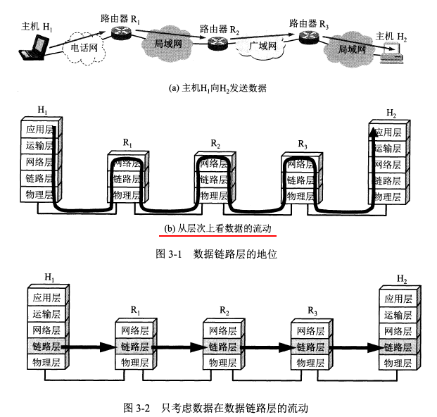 

路由器转发分组时只涉及到下面三层。

**3.1 使用点对点信道的数据链路层**

**3.1.1 数据链路和帧**

**数据链路**既包含物理线路也包含必要的通信协议，将实现协议的软件和硬件加到链路上就构成了数据链路。

>
>
>网络适配器（Network Adapter），也称为网卡 （`NIC`，全称 Network Interface Card），是计算机或设备用于连接网络的硬件或软件组件。它的主要功能是让设备能够通过有线或无线方式接入局域网（LAN）或互联网（Internet）。

常用**网络适配器**（既包括硬件也包括软件）来实现这些协议，一般适配器包括了数据链路层和物理层两层的功能。

**帧**是点对点信道的数据链路层的**协议数据单元**。网络层的协议数据单元是**`IP`数据报**，又称分组。

数据链路层将网络层交下来的数据构成帧发送到链路上，以及把接收到的帧里的数据取出并上交给网络层。

​     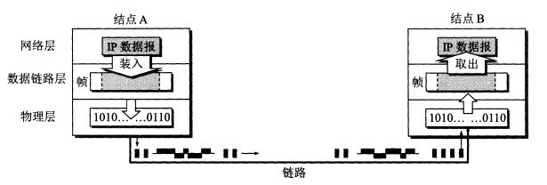 

点对点信道的数据链路层在通信时的**主要步骤：**

1. 节点A的数据链路层把网络层交下来的`IP`数据报加上首部和尾部封装成帧。
2. 节点A把封装好的帧发送给结点B。
3. 节点B对接收到的帧进行差错检验，若无差错，从帧中提取出`IP`数据报上交给网络层，若有差错丢弃这个帧。

**3.1.2 三个基本问题**

数据链路层的三个基本问题：**封装成帧、透明传输、差错检验**

**封装成帧**

给 `IP` 数据报加上首部和尾部就构成了数据链路层的帧，`IP` 数据报成为帧的数据部分。

链路层协议规定了帧中数据部分的长度上限——**`最大传送单元（MTU）`**。

>
>
>"`MTU`（Maximum Transmission Unit） 是指在数据链路层 中，一次传输的数据帧可以承载的最大数据量（不包括数据链路层头部和尾部） ，单位是字节（Byte）。 "

首部和尾部包括**帧定界符**（即确定帧的界限）和其他控制信息。

帧定界符包括开始符（`SOH`）和结束符（`EOT`），分别是一串8位二进制数字。

帧定界符的作用：确定帧的界限。当出现差错时可以根据帧定界符识别是否是一个完整的帧。

**透明传输**

透明传输是因为控制字符产生的。数据链路层对上层协议（如网络层）传递下来的数据不加任何限制和修改，无论这些数据中包含什么样的比特组合或字符，都能**原样无误地通过数据链路传输** ，就像这条链路是“透明”的一样。

实现透明传输的几种方式：

**1.字节填充**：因为存在帧定界符，如果传输的数据中出现了和SOH、EOT等控制字符一样的文本，就在文本前面插入一个转义字符（ESC），接受端收到数据后在发送给网络层之前删除这个插入的转义字符。如果转义字符也出现在数据中，就在它前面再插入一个转义字符。

​     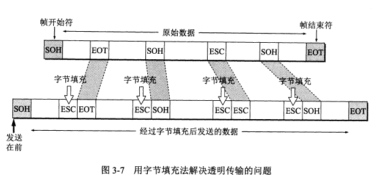

**2.比特填充法**:

**比特填充法（Bit Stuffing）** 是数据链路层实现**帧同步** 和**透明传输** 的一种关键技术，常用于面向比特的协议中（如 HDLC、PPP 的同步模式）。它的核心思想是：在数据中插入额外的比特来避免与帧定界符冲突，从而保证接收方能够正确识别帧的边界。 

在很多面向比特的协议中，帧定界符是一个**固定的比特序列** ，最常见的是：`01111110`

**发送方**:检测到数据中有连续 5 个 1 （即 `11111`）时，在其后插入一个 0 ，这样就可以避免出现 `1111110` 或 `1111111` 这样的帧定界符。

**接收方**:在接收到数据后，会检查是否有连续的 5 个 1 后面跟着一个 0，如果有，则自动将这个 0 删除，恢复原始数据。

**差错检测**

**比特差错**：传输时产生差错，0变成了1或1变成了0.

**误码率BER**：一段时间内，传输错误的比特占所传输比特总数的比率。提升`信噪比`可以减小误码率。

::: info

**信噪比（Signal-to-Noise Ratio，简称 `SNR` 或 S/N）** 是通信和信号处理领域中的一个核心概念，用于衡量**有用信号与背景噪声的相对强度** 。它在模拟和数字通信、音频处理、图像处理、无线网络等领域都有广泛应用。

**信噪比（`SNR`）** 是指**信号功率与噪声功率的比值** ，通常用**分贝（dB）**表示。 

### 公式：

$$
\text{SNR (dB)} = 10 \cdot \log_{10} \left( \frac{P_{\text{signal}}}{P_{\text{noise}}} \right)
$$

或者如果是电压或电流信号（因为功率与电压平方成正比）：
$$
\text{SNR (dB)} = 20 \cdot \log_{10} \left( \frac{V_{\text{signal}}}{V_{\text{noise}}} \right)
$$

其中：

- *P*signal：信号的平均功率
- *P*noise：噪声的平均功率
- *V*signal,*V*noise：信号和噪声的有效电压值

:::

差错检验的方法：**循环冗余检验`CRC`**

**循环冗余检验的原理：**

在要传输的数据后加上n位的冗余码（成为**帧检验序列`FCS`**），如何得出冗余码：让数据乘以$2^n$（相当于在后面加了n个0），然后除以一个事先约定的 n+1 位的除数P，得出 n 位的余数 R 就作为冗余码加到数据后面。接收端将收到的每一个帧除以同样的除数 P，若余数为 0 就表明没有差错，否则就是有差错，丢弃这个帧。

循环冗余检验使用硬件完成，速度很快。

循环冗余检验只能识别比特差错，无法识别帧丢失、帧重复、帧失序，因此不是可靠传输。

对于通信质量较差的无线传输链路，数据链路层协议使用帧编号、确认和重传机制。即接收方收到正确的帧就向发送方发送确认，如果发送方没有收到确认就表明出现差错，就进行重传直到收到对方的确认。

对于通信质量较好的有线传输链路，只进行`CRC`检验，不使用确认和重传机制，即不需要数据链路层向上提供可靠传输，而是由上层协议来改正差错。

本章的 **`PPP` 协议**和 **`CSMA/CD` 协议**都不是可靠传输的协议。

**3.2 点对点协议`PPP`**

**点对点协议 `PPP`** 是目前点对点链路中应用最广泛的数据链路层协议。

**3.2.1 `PPP`协议的特点**

`PPP` 协议是用户和 `ISP` 通信时使用的数据链路层协议。

**`PPP` 协议应满足的需求**

1. **简单**。这是首要的需求。互联网体系结构中最复杂的部分在 TCP 协议中，网际协议 `IP` 和数据链路层协议都不是可靠传输。

   :::info

   不可靠传输是指：也就是说，如果在传输过程中发生了错误（如噪声干扰、校验失败等），数据链路层**不会自动重传或纠正错误** ，而是将这些任务交给上层协议（如传输层 TCP）来处理。

   :::

2. **封装成帧**。`PPP` 协议规定使用特殊的字符作为帧定界符。通常是`01111110`

3. **透明传输**。

4. **支持多种网络层协议。**`PPP` 协议要能够在同一条物理链路上同时支持多种网络层协议。

5. **支持多种类型链路**。包括串行的或并行的、同步的或异步的等。例如` PPPoE`（在以太网上运行的`PPP`），用户通过以太网上网时使用的是`PPPoE`协议，它将` PPP` 帧再封装到一个以太网帧中。

6. **差错检测。**如果收到有错的帧就丢弃。

7. **最大传送单元**。要为每一种类型的点对点链路设置最大传送单元`MTU`。注意 `MTU` 是数据部分的最大长度。

8. **网络层地址协商。**`PPP` 协议要提供一种机制使通信的两个网络层的实体能通过协商知道彼此的网络层地址。

9. **数据压缩协商**。`PPP` 协议要提供一种方法来协商使用数据压缩算法。

`TCP/IP` 协议族中，可靠传输由 `TCP` 协议负责。`PPP` 不负责纠错等。`PPP` 只支持点对点的链路通信，且只支持全双工链路。

**`PPP` 协议的组成**

`PPP` 协议有**三个组成部分：**

1. 一个将 `IP` 数据报封装到串行链路的方法。
2. 一个用来建立、配置和测试数据链路连接的**链路控制协议`LCP`**。
3. 一套**网络控制协议 `NCP`**，其中的每一个协议支持不同的网络层协议。

**3.2.2 `PPP`协议的帧格式**

**各字段的含义**

`PPP` 的首部和尾部分别为4个字段和2个字段。

首部的第一个字段和尾部的第二个字段都是**标志字段 F(帧界定符)，**规定为 `0x7E`，它标志着一个帧的开始或结束。两个连续的帧之间只需要一个 F，如果连续出现两个标志字段，表示这是一个空帧(两个F之间没有数据)，应该丢弃。

首部字段：

F：`flag`，长度一个字节(8bits)，表示界定符的8位比特，通常是`01111110`即`0x7E`。

A：`Address`，长度一个字节(8bits)，固定值为`0xFF`，表示广播地址。

C：`Control`，控制字段，长度是一或两个字节。表示无编号的信息帧。

协议：`Protocol`，指明字段中封装的是哪种上层协议的数据报，常用取值如下表

| 16进制表示 | 协议                     |
| ---------- | ------------------------ |
| `0x0021`   | IPv4                     |
| `0x0057`   | IPv6                     |
| `0x002B`   | IPX                      |
| `0x8021`   | IPCP（IP 控制协议）      |
| `0xC021`   | LCP（链路控制协议）      |
| `0xC023`   | PAP（密码认证协议）      |
| `0xC223`   | CHAP（挑战握手认证协议） |

尾部字段：

FCS：帧校验序列，用于差错检测（CRC 校验），接收方通过计算 CRC 判断数据是否出错。

F：`flag`，长度一个字节(8bits)，表示界定符的8位比特，通常是`01111110`即`0x7E`。

首部的第二个和第三个字段 目前都没有实际含义。第四个字段是 2 字节的协议字段，它表明了信息部分的数据类型（可能是`IP`数据报也可能是其他类型的数据）。**尾部的第一个字段是帧检验序列 `FCS`。**

​     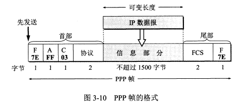 

**字节填充**

`PPP` 使用异步传输时使用了**字节填充**，转义符为 `0x7D`。

**零比特填充**

`PPP` 协议用在 `SONET/SDH` 链路上时使用同步传输，此时采用**零比特填充**方法来实现透明传输。

零比特填充的方法：当信息字段中出现 5 个连续的 1，立即填入一个 0，这样信息字段中就不会出现 6 个连续的 1（`PPP` 的帧定界符中有 6 个连续的 1）。

**3.2.3 `PPP`协议的工作状态**

`ISP`：网络服务提供商，例如电信，移动...

**`PPP` 链路从建立到释放的全过程**：用户拨号接入 `ISP` 后，就建立了从用户到 `ISP` 的物理连接。这时用户向 `ISP` 发送一系列的链路控制协议 `LCP` 分组，以便建立 `LCP` 连接。然后网络控制协议 `NCP` 给新接入的用户电脑分配一个临时的 `IP` 地址。等用户通信完毕后，`NCP` 释放网络层连接，收回分配的 `IP` 地址，然后 `LCP` 释放数据链路层连接，最后释放物理层连接。

**`PPP` 链路的状态变化**：链路静止——链路建立——鉴别——网络层协议——链路打开——链路终止——链路静止。

1. **链路静止**：`PPP` 链路的其实和终止状态都是链路静止状态。

2. **链路建立：**当个人电脑当建立了到路由器的物理层连接后，`PPP` 进入链路建立状态，目的是建立链路层的 `LCP` 连接。(LCP 是 PPP 中专门用于控制链路连接的协议 )。通过发送 `LCP` 的配置请求帧（是一个 `PPP` 帧，协议字段为 `LCP` 对应的代码，信息字段包括特定的配置请求）来协商配置选项，链路的另一端可以回复配置确认帧、配置否认帧或配置拒绝帧。

4. **鉴别**：若鉴别身份失败就转到链路终止状态，若成功就进入网络层协议状态

5. **网络层协议**：这时 `PPP` 链路的两端的网络控制协议 `NCP` 根据网络层的不同协议互相交换网络层特定的网络控制分组。`PPP` 链路的两端可以运行不同的网络层协议。

6. **链路打开**：此时链路的两个 `PPP` 端点可以彼此发送分组。数据传输结束后链路的一端发送终止请求 `LCP` 帧请求终止链路连接，收到终止确认后转到链路终止状态。

8. **链路终止**。终止后进入链路静止状态。

9. **链路静止**。

​     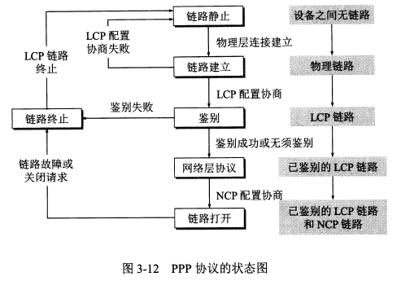 

可以看到，`PPP` 协议不是纯粹的数据链路层协议，还包含了物理层和网络层的内容。

**3.3 使用广播信道的数据链路层**

广播信道可以进行一对多的通信，**局域网用的就是广播信道。**

局域网可以按照拓扑结构进行分类。

​     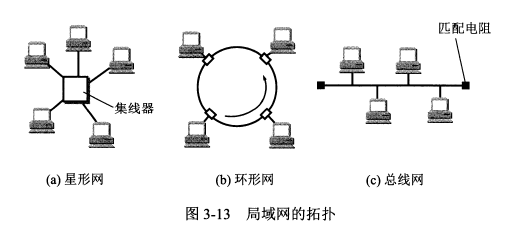 

**3.3.1 局域网的数据链路层**

**局域网的最主要特点**：网络为一个单位所拥有，且地理范围和站点数目都有限。

**局域网的优点：**

1. 具有广播功能，可以从一个站点很方便地访问全网。局域网上的主机可以共享连接在局域网上的各种硬件和软件资源。
2. 便于系统的扩张和逐渐演变
3. 提高了系统的可靠性、可用性和生存性。

**以太网是局域网的一种，绝大多数局域网都是以太网**。双绞线是局域网中的主流传输媒体。

**实现共享信道有两种方法：**

1. **静态划分信道**，如频分复用、时分复用、码分复用等，但不适合局域网。
2. **动态媒体接入控制**，又称**多点接入**。特点是信道并非在用户通信时固定分配给用户。
   + **随机接入**：特点是用户可以随机地发送消息。如果有两个用户同时发送，在共享媒体上就会产生碰撞，是发送失败。这时就需要解决碰撞的网络协议，即 `CSMA/CD` 协议。
   + **受控接入**：特点是用户不能随机发送信息而必须服从一定的控制。

**以太网应用的主要是随机接入。**

由于历史原因以太网层被拆分为两个子层：逻辑链路控制 `LLC` 和**媒体接入控制 MAC**。现在 `LLC` 基本已经消失了，主要是 MAC 协议。

**适配器的作用**

计算机与外界局域网的连接是通过适配器进行的，适配器以前又称网卡。

适配器和局域网之间的通信通过电缆或双绞线以串行传输方式进行的，而适配器与计算机之间的通信是通过 I/O 总线并行传输的，因此适配器的一个重要功能就是进行数据串行传输和并行传输的转换。

适配器实现的功能包含了数据链路层和物理层两个层次的功能。

适配器收到正确的帧后，使用中断来通知计算机，并把数据交付给协议栈中的网络层。当计算机要发送 IP 数据报时，就由协议栈把分组交给适配器，适配器将其组装成帧后发送到局域网。（封装成帧、透明传输、差错检错等功能都是由适配器完成的）

计算机的**硬件地址存储在适配器中**，**而软件地址——IP地址存储在计算机中**。

​     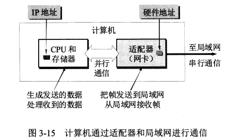 

**3.3.2 `CSMA/CD`协议**

局域网上的计算机常被称为工作站、站点等。

**为了通信的简便，以太网采取了以下两种措施：**

1. 采用较为灵活的无连接的工作方式，即不必建立连接就可以直接发送数据。适配器对发送的数据帧不编号，也不要求对方发回确认。它提供的是尽最大努力的交付，是不可靠的交付。对有差错帧是否进行重传由高层来决定。

2. 同一时间只能有一台计算机发送数据，如果发生冲突，就使用 `CSMA/CD` 协议来协调。

3. 以太网发送的数据使用的是曼彻斯特编码。

**`CSMA/CD` 协议的要点**

1. **多点接入**：多点接入说明是总线型网络，许多计算机以多点接入的方式连接在一根总线上。**协议的实质就是载波监听和碰撞检测**。
2. **载波监听**：使用电子技术检测信道上有没有其他计算机也在发送。不管是发送前还是发送中，每个站都要不停地监听信道。
3. **碰撞检测**：边发送边监听。如果几个站同时发送数据，总线上的信号电压变化会增大，就表明发生了碰撞。这时就立即停止发送。

在使用 `CSMA/CD` 协议时，不能同时发送和接收，因此使用 `CSMA/CD` 协议的以太网只能进行半双工通信（双向交替通信）。

发生碰撞是因为**传播时延**，A 发送了数据但是还没传到 B 处，B 就不知道有人发送了数据。

当 A 和 B 同时发送数据产生碰撞后，他们发送数据都失败，都要推迟一段时间重新发送。

因为不知道是否会发生碰撞，所以以太网存在**发送的不确定性**。

A 发送数据后最多 2θ 时间就知道是否碰撞，这 2θ 时间称为**争用期**。如果经过争用期还没碰撞，表明发送成功。

如果发生碰撞，以太网使用**截断二指数退避算法**来确定碰撞后重传的时机。

:::info

**截断二指数退避算法**

1. 每次发生冲突后，**重传的等待时间从一个不断增大的窗口中随机选择** ；
2. 等待时间的取值范围是：`0 到 2^k - 1` 个时隙（slot time）之间；
3. `k` 的最大值被限制为一个固定数（通常为 10 或 16），这就是所谓的“**截断** ”；
4. 如果达到最大重传次数仍未成功，则放弃传输并报告错误。

:::

以太网规定了争用期的时长，这就约束了以太网的地理范围不能太大，不然传播时延会超过争用期限制。

以太网规定最短帧长为 64 字节（一个争用期可以发送的字节数），如果争用期发生碰撞就会停止发送，因此信道上长度小于 64 字节的帧就是无效帧。

碰撞后除了立即停止发送数据外还要继续发送一个人为干扰信号，通知所有用户现在发生了碰撞。

以太网还规定了**帧间最小间隔** 96 比特时间，这是为了使刚收到数据帧的栈清理缓存，准备接收下一帧。

​     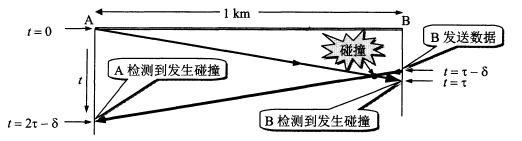 

**`CSMA/CD` 协议的要点归纳**

1. **准备发送**：适配器从网络层获得一个分组，加上首部和尾部组成以太网帧，放入适配器缓存中。在发送前先检测信道。

2. **检测信道：**若检测到信道忙，则不停地检测直到信道空闲。若检测到空闲，并在 96 比特时间内保持空闲（保证了帧间最小间隔），就发送这个帧。

3. 在发送过程中仍不停地检测，即适配器要**边发送边监听**。这时有两种情况

4. 1. **发送成功：**争用期内一直未检测到碰撞。发送成功后回到 1。
   2. **发送失败**：争用期内检测到碰撞，立即停止发送，并按规定发送人为干扰信号。适配器接着执行**指数退避算法**，等待足够时间后回到 2。若重传 16 次仍不成功，就停止重传并向上报错。

以太网发送完一帧后要把已发送的帧保留一下。如果争用期检测到碰撞，推迟一段时间后还要重传。

**3.3.3 使用集线器的星形拓扑**

现在的以太网采用星形拓扑，在星形中心使用可靠性非常高的集线器。每个站用两对双绞线，分别用于发送和接收。

集线器的特点：

1. 表面上使用集线器的局域网在物理上是一个星形网，但是在**逻辑上仍是一个总线网**，各站共享逻辑上的总线，还是使用 `CSMA/CD` 协议。
2. 一个集线器有很多接口，像是一个多接口的转发器。
3. 集线器工作在物理层，每个接口仅负责转发比特，不进行碰撞检测。

​     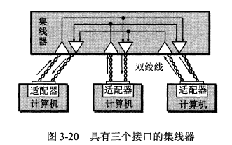 

**3.3.4 以太网的信道利用率**

因为发生碰撞会浪费信道资源，所以以太网的信道利用率达不到100%。

减少端到端的传播时延、可以提高信道利用率，因此以太网的连线的长度不能太长，同时以太网的帧长不能太短。

**3.3.5 以太网的MAC层**

**MAC 层的硬件地址**

局域网中，**硬件地址又叫 MAC 地址。**

IEEE 为局域网规定了一种 **6 字节的全球地址**，是局域网上的每一台计算机中**固化在适配器中的地址**。因此如果更换了新的适配器，硬件地址也就变了。

适配器上的标识符 **`EUI-48`** 就是计算机的硬件地址。

路由器通过适配器连接到局域网时，适配器上的硬件地址标志路由器的一个接口。如果路由器同时连到多个网络上，就需要多个适配器有多个硬件地址。

局域网中适配器收到的帧有三种：

1. **单播帧（一对一）**：即收到的帧的 MAC 地址与本站的地址相同。
2. **广播帧（一对全体**）。
3. **多播帧（一对多**）。

适配器至少能够识别前两种帧。

以太网适配器有一种特殊的工作方式：**混杂方式**。混杂方式的适配器只要”听到“有帧再传输就悄悄接收下来。

混杂方式可以用来监视和分析以太网上的流量，黑客也常用混杂方式非法获取信息。

**MAC 层的帧格式**

最常用的 MAC 帧格式是”**以太网`V2`标准**“，此外还有 IEEE 的 **802.3 标准**。

MAC 帧的首部共有源地址字段、目的地址字段、用来标识上层使用什么协议的类型字段这3个字段，尾部有一个帧检验序列`FCS`。

MAC 帧没有帧定界符也没有帧长度字段。因为它用的是曼彻斯特码，曼彻斯特码的码元中间有一个电压跳变。当发送方发完一个帧后就不发送码元了，这是接收方发现没有跳变了就知道帧结束了。

MAC 帧在向下传送到物理层时要在帧前面插入 8 字节，包括一个前同步码和一个帧开始定界符。前同步码用来通知接收端调整时钟频率以与发送端的时钟同步。

MAC 帧的最小长度是 64 字节，其中数据字段最小长度是 46 字节。如果不够就要进行填充。IP数据报的首部有一个”总长度“字段，网络层根据它来识别填充字段的长度并丢弃掉。

**3.4 扩展的以太网**

有时会对以太网的范围进行扩展。这种扩展的以太网在网络层看来仍然是一个网络。

**3.4.1 在物理层扩展以太网**

由于 `CSMA/CD` 协议的限制，以太网的主机之间距离不能太远。

可以使用**光纤**来扩展主机和集线器之间的距离，因为光纤的时延小带宽宽，所以可以很轻松地将主机和集线器的距离扩展到几千米。

可以将多个以太网通过**主干集线器**连接起来形成一个更大的以太网。

​     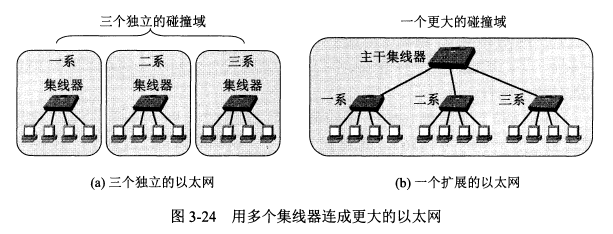 

多个以太网通过连接进行扩展后的优点是可以实现不同以太网间的通信，且扩大了地理范围。缺点是碰撞域会增大，发送数据产生碰撞的概率增加。

**3.4.2 在数据链路层扩展以太网**

扩展以太网更多的是在数据链路层扩展。

以太网通过**以太网交换机（又称第二层交换机）**来在数据链路层进行扩展。

**以太网交换机的特点**

以太网交换机实际上是一个多接口的网桥，每个接口直接与一台主机或另一个交换机相连，一般工作在全双工方式。

以太网交换机具有并行性，可以同时连接多对接口，使多对主机同时通信。相互通信的主机都独占传输媒体，无碰撞地传输数据。

以太网交换机是一种即插即用设备，它内部的帧交换表（又称地址表）是通过**自学习算法**自动地逐渐建立起来的。

**以太网交换机的最大优点**

**交换机的最大优点：它的并行性。**多对主机同时通信并不会平分总带宽，因为每对主机独占其传输媒体的带宽，所以每对主机的带宽还是原带宽。

传统的`10Mbit/s` 的共享式以太网，如果有 10 个用户，则每个用户的平均带宽为 `1Mbit/s`，而用以太网交换机来连接这些主机，10 个用户的带宽都是 `10Mbit/s`，相当于总带宽 `100Mbit/s`。

**以太网交换机的自学习功能**

实现自学习的两个关键点：

1. 若有主机发送数据，就把该主机的MAC地址与对应接口存入交换表。
2. 若交换表中找不到数据接收方的对应接口，就对所有接口进行广播。

​     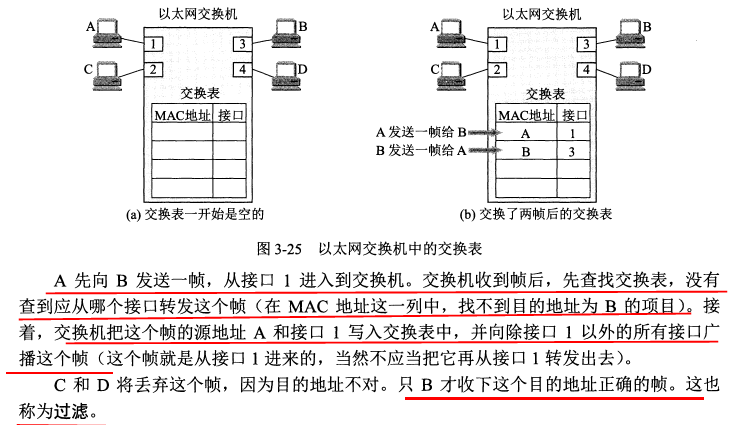 

因对接口连接的主机可能会改变，主机的网络适配器也可能改变，所以交换表中的每个项目都有有效时间，时间过了就会删除。

**从总线以太网到星形以太网**

总线以太网使用 **`CSMA/CD`** 协议，以**半双工方式**工作。

而以太网交换机**不使用共享总线，没有碰撞问题**，因此不使用 `CSMA/CD` 协议，而是以全双工方式工作。

**3.4.3 虚拟局域网**

使用以太网交换机可以方便地实现**虚拟局域网 `VLAN`**。

**虚拟局域网 `VLAN`**：它是由一些局域网网段构成的与物理位置无关的逻辑组，这些网段具有某些共同的需求。每一个 `VLAN` 的帧都有一个明确的标识符，指明发送这个帧的计算机属于哪一个 `VLAN`。

虚拟局域网是局域网给用户提供的一种服务，不是一种新型局域网。

下图中每一个 `VLAN` 的计算机可以处于不同的局域网中。

​     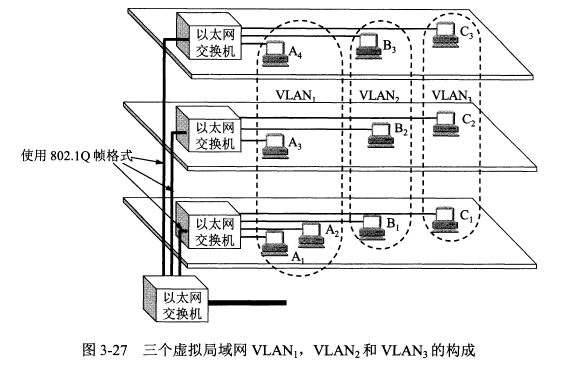 

**3.5 高速以太网**

现在的以太网的速率已经从传统的 `10Mbits/s` 发展到了 `1Gbit/s` 的吉比特以太网。11

**3.5.1 `100BASE-T` 以太网**

**`100BASE-T`** 是在双绞线上传送 `100Mbit/s` 基带信号的星形拓扑以太网，仍使用 `CSMA/CD` 协议，又称快速以太网。

`100BASE-T` 可以使用以太网交换机，当使用以太网交换机时工作在全双工状态，且不使用 `CSMA/CD` 协议。

快速以太网使用的 MAC 帧格式仍然是 `IEEE802.3` 标准规定的帧格式。

**3.5.2 吉比特以太网**

**吉比特以太网**有以下几个特点：

1. 允许在 `1Gbit/s` 下以全双工和半双工两种方式工作。
2. 使用 IEEE 802.3 协议规定的帧格式。
3. 在半双工方式下使用 `CSMA/CD` 协议，在全双工方式不使用。
4. 与 `10BASE-T` 和 `100BASE-T` 向后兼容。

吉比特以太网在半双工时，采用了**“载波延伸”**方法，延长争用期与发送的 MAC 帧最小长度到 512 字节。这在发送短帧时需要进行大量填充造成了额外开销。

还增加了**“分组突发”**的功能，当很多短帧要发送时，第一个短帧采用载波延伸的方法进行填充，后面的则一个接一个地发送而不需填充。

**3.5.3 10吉比特以太网和更快的以太网**

**`10GE`** 的帧格式与 `10Mbit/s`, `100Mbit/s` 和 `1Gbit/s` 的帧格式完全相同，最小帧长和最大帧长也相同。

`10GE` 只工作在全双工方式，**不使用 `CSMA/CD` 协议**，这使它的传输距离极大地提高。

以太网技术发展很快，`10GE` 后面又制定了 `40GE` 和 `100GE` 的标准，他们都只工作在全双工方式。传输距离可达几十千米。

现在以太网的工作范围已经扩大到城域网和广域网，它的优点是：

1. 技术成熟。
2. 互操作性好。
3. 价格便宜。广域网中使用以太网时价格比同步光纤网`SONET`便宜很多。
4. 端到端的以太网连接使帧的格式全都是以太网的格式，不需要进行帧格式转换。

以太网的发展证明了**以太网的优点：**

1. 可扩展（从 `10Mbit/s` 到 `10 Gbit/s`）。
2. 灵活（多种媒体、全/半双工，共享/交换）。
3. 易于安装。
4. 稳健性好。

**3.5.4 使用以太网进行宽带接入**

现在也使用以太网进行宽带接入互联网。

以太网接入可以提供双向的宽带通信，且可以根据需要灵活地升级（如从 `10M` 到 `10G`）。

但是以太网的帧格式中没有用户名字段和让用户键入密码来鉴别用户身份的过程。于是诞生了 `PPPoE`（在以太网上运行`PPP`），它把 `PPP` 协议中的 `PPP` 帧封装到以太网中来传输。现在的光纤宽带接入 `FTTx` 都是用 `PPPoE`。

