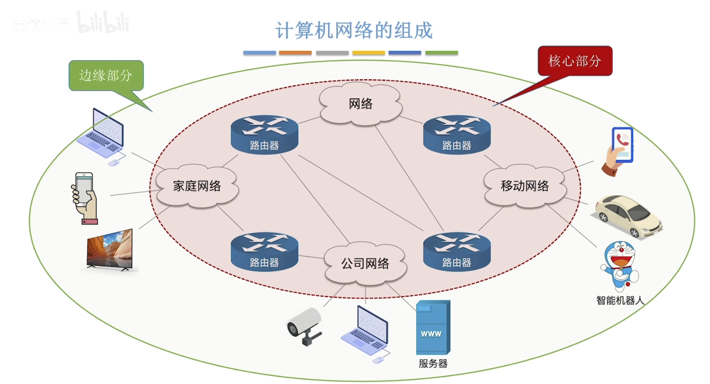

# 互联网的概述

 ## 什么是计算机网络？

计算机网络是一个将众多分散的、自治的计算机系统，通过通信设备与线路连接起来，由功能完善的软件实现资源共享和信息传递的系统。

与网络相连接的计算机称为主机，在互联网中的路由器，是一种特殊的计算机（有CPU,存储器，操作系统）等，但不能称为主机。

## 计算机网络、互连网、互联网之间的区别

1. **计算机网络**：

   由若干个`节点`和连接这些节点的`链路`组成。

   节点：可以是计算机、集线器、交换机、路由器等。

   链路：可以是有线链路和无线链路

2. **互连网**：

   通过路由器把两个或多个计算机网络互相连接起来，形成规模较大更大的计算机网络，称为“互连网”。

3. **互联网**：

   由各大ISP和国际机构组建的，覆盖全球范围的互连网。（特指全球最大的计算机网络）

   互联网必须使用`TCP/IP`协议进行通信，互连网可以使用任意协议通信。

   

## 计算机网络的组成和功能

#### 组成

+ **从组成部分看**：

  1. 硬件：
     + 主机（与网络相连接的计算机称为主机），也称`端系统`：如电脑，手机物联网设备等
     + 通信设备：如集线器、交换机、路由器
     + 通信线路：如光纤、网线等。
  2. 软件：实现数据交换的通信软件
  3. 协议：
     + 规定计算机网络中的通信规则
     + 由硬件、软件共同实现，如：网络适配器（网卡）+软件 实现网络通信协议

+ **从工作方式看**：

  1. 边缘部分：

     + 工作方式：直接为以后服务
     + 主要由连接到互联网上的主机及其软件组成

  2. 核心部分

     + 工作方式：为边缘部分提供服务（连通性，交换服务：动态的选择数据在网络当中传送的路径，保证网络中传输路径的负载不会太重）
     + 由大量网络和连接这些网络的路由器组成

     

+ **从逻辑功能上看**：

  1. 资源子网：
     + 计算机网络中运行应用程序，向用户提供可共享的硬件、软件和信息资源的部分
     + 主要由连接到互联网上的主机组成
  2. 通信子网
     + 计算机网络中负责计算机信息传输的部分
     + 主要由通信链路+ 通信设备 + 协议 构成
     + 主机内部实现信息传输的网络适配器、底层协议 属于通信子网的范畴

#### 功能：

1. 数据通信：实现计算机之间的数据传输。是最基本、最重要的功能
2. 资源共享：硬件（智能音箱 请求服务器处理，服务器属于硬件资源）、软件（软件应用商店）、数据资源（分享视频）
3. 分布式处理：将某个复杂任务分配给网络中的多台计算机处理
4. 提高可靠性：网络中各台计算机互为替代机
5. 负载均衡：网络中各台计算机共同分担繁重工作