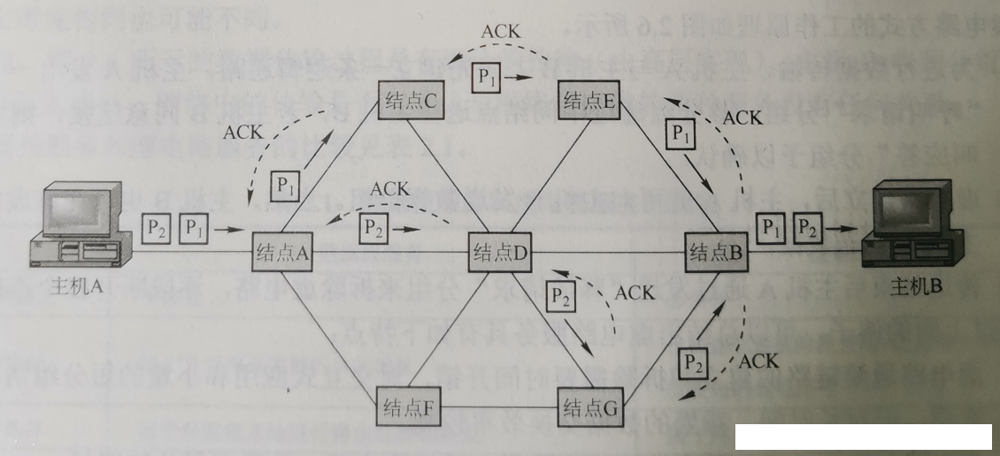
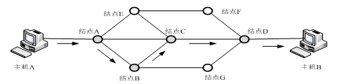
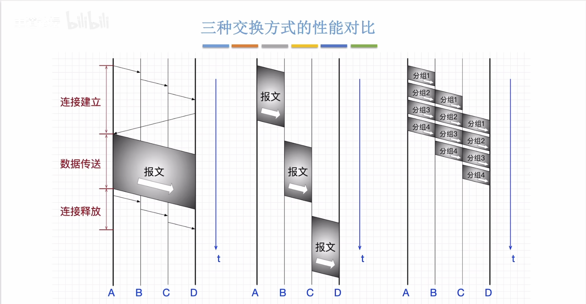
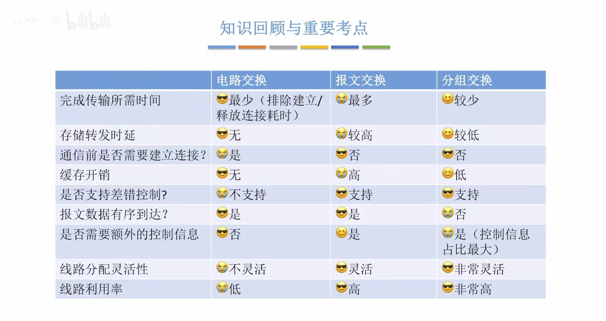

# 互联网的核心部分

## 三种数据交换技术 

1. 电路交换：用于电话网络

   **电路交换过程**：

   + 建立连接（尝试占用通信资源）
   + 通信（一直占用通信资源）
   + 释放连接（归还通信资源）

   **优点**：通信前从主叫端到被叫端建立一条专用的物理通道，在通信的全部时间内，两个用户始终占用端到端的线路资源。数据直送，传输效率高

   **缺点**：

   + 建立/释放连接，需要额外的时间开销。 
   + 线路被通信双方独占，利用率低。
   + 线路分配的灵活性差
   + 交换节点不支持“差错控制”（无法发现传输过程当中的数据错误）

   电路交换适用于：低频次、大量地传输数据。

2. 报文交换：用于电报网络

   报文：控制信息和用户数据共同组成。

   控制信息包含：发送方和接收方的数据。

   用户数据：用户发送的数据。

   存储转发的思想：把传送的数据单元线存储进中间节点，再根据目的地址转发至下一节点

   优点：

   + 在数据交换之前不需要建立连接 
   + 数据以`报文`为单位被交换节点间`存储转发`，通信线路可以灵活分配
   + 在通信时间内，两个用户无须独占一整条物理线路，相比于电路交换，线路利用率更高
   + 交换节点支持`差错控制`（保证数据准确性）

   缺点：

   + 报文是不定长 的，不方便存储转发管理。
   + 长报文的存储转发时间开销大，缓存开销大。
   + 长报文容易出错，重传代价高。

3. 分组交换：

   将报文交换数据切分成多个定长的部分。

   每个部分都包含：

   + 首部：分组的控制信息：包含源地址、目的地址，分组号等
   + 数据：切分的用户数据

   优点：具备报文交换技术的所有优点，且改进了以下问题：

   + 分组定长，方便存储转发
   + 分组的存储转发时间开销小，缓存开销小
   + 分组不容易出错，重传代价低

   缺点：

   + 相比于报文交换，控制信息占比增加
   + 相比于电路交换，依然存在存储转发时延
   + 报文被拆分为多个分组，传输过程中可能出现失序，丢失等问题，增加处理的复杂度
   
   分组交换下的两种数据交换方式：
   
   1. **数据报方式**：
   
      
   
      + 源主机（A）将报文分成多个分组，依次发送到直接相连的节点。
      + 节点A收到分组后，对每个分组差错控制和路由选择，不同分组的下一个节点可能不同。
      + 节点C收到分组P1后，对分组P1进行差错检测，若正确则向A发送确认信息，A收到C确认后则丢弃分组P1副本。
      + 所有分组完成发送。
   
      数据报方式的特点：
   
      1. 数据报方式为网络层提供`无连接服务`。发送方可随时发送分组，网络中的节点可随时接收分组。（无连接服务：不事先为分组的传输确定传输路径，每个分组独立确定传输路径，不同分组传输路径可能不同）。
      2. 同一报文的不同分组达到目的节点时可能发生乱序、重复与丢失。
      3. 每个分组在传输过程中都必须携带源地址和目的地址，以及分组号。
      4. 分组在交换节点存储转发时，需要排队等候处理，这会带来一定的时延。当通过交换节点的通信量较大或网络发生拥堵时，这种时延会大大增加，交换节点还可根据情况丢弃部分分组。
      5. 网络具有冗余路径，当某一交换节点或一段链路出现故障时，可相应地更新转发表，寻找另一条路径转发分组，对故障的适应能力强，适用于突发性通信，不适合长报文、会话式通信。
   
   2. **虚电路方式**：
   
      虚电路将数据数据报方式和电路交换方式结合，以发挥两者的优点。
   
      虚电路：一条源主机到目的主机类似于电路的路径（逻辑联机）。路径上的所有节点都要维持这条虚电路的建立，都维持一张虚电路表，每一项纪录了一个打开的虚电路信息。
   
      
   
      + 建立连接：源主机发送“呼叫请求”并且分组收到“呼叫请求应答”后才算建立连接。
      + 数据传输：每个分组携带虚电路号，分组号、检验等控制信息。
      + 释放连接：源主机发送“释放请求”分组以拆除虚电路。
   
      虚电路方式的特点：
   
      1. **虚电路方式**为网络层提供`连接服务`。源节点于目的节点之间建立一条逻辑连接，而非实际物理连接。（连接服务：首先为分组的传输确定传输路径`建立连接`，然后沿该路径`连接`传输系列分组，系列分组传输路径相同，传输结束后拆除连接）。
      2. 一次通信的所有分组都通过虚电路顺序传送，分组不需携带源地址、目的地址等信息，包含**虚电路号**，相对数据报方式开销小，同一报文的不同分组到达目的节点时不会乱序、重复或丢失。
      3. 分组通过虚电路上的每个节点时，节点只进行差错检测，不需进行路由选择。
      4. 每个节点可能与多个节点之间建立多条虚电路，每条虚电路支持特定的两个端系统之间的数据传输，可以对两个数据端点的流量进行控制，两个端系统之间也可以有多条虚电路为不同的进程服务。
      5. 致命弱点：当网络中的某个节点或某条链路出故障而彻底失效时，则所用经过该节点或链路的虚电路将遭受到破坏。

## 性能对比

性能对比总结：

