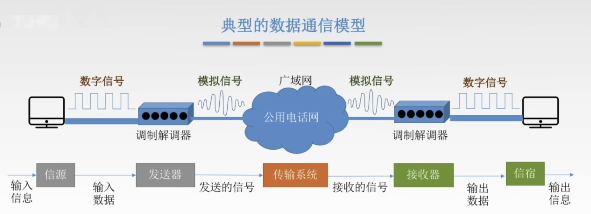

# 数据通信的基础知识

## 数据通信模型

## 相关术语

1. 通信的目的是传送`消息`（消息：语音，文字，图像，视频）。

2. 数据(data)：传送信息的实体，通常是有意义的符号序列。

3. 信号：数据的电气/电磁的表现，是数据在传输过程中的存在形式。
   + 数字信号（离散信号）：代表消息的参数的取值是离散的。
   + 模拟信号（连续信号）：代表消息的参数的取值是连续的。
4. 信源：产生和发送数据的源头。
5. 信宿：接收数据的终点。
6. 信道：信号的传输媒介。一般用来表示向某一个方向传送信息的介质，因此一条通信线路往往包含一条发送信道和一条接收信道。
   + 按传输信号分：模拟信道（传送模拟信号） 数字信道（传送数字信号）
   + 按传输介质分：1.无线信道 2.有线信道
7. 码元：是指用一个固定时长的信号波形（数字脉冲），代表不同离散值的基本波形，是数字通信中数字型号的计量单位，这个时长内的信号称为k进制码元，而该时长称为码元宽度。当码元的离散状态有M个时（M大于2），此时码元为M进制码元。1码元可以携带多个比特的信息量。例如，在使用二进制编码时，只有两种不同的码元，一种代表0状态，另一种代表1状态。

## 三种通信方式

从通信双方交互方式看，可以有三种基本方式：

1. 单工通信：只有一个方向的通信而没有反方向的交互，仅需要`一条`信道。
2.  半双工通信/双向交替通信：通信的双方都可以发送或接收信息，但任何一方都不能同时发送和接收，需要两条信道。
3.  全双工通信/双向同时通信：通信双方可以同时发送和接收信息，也需要两条信道。

## 串行传输&并行传输

**串行传输**

表示将一个字符的8位二进制数按由低到高位的顺序依次发送。

**并行传输**

将表示一个字符的8位二进制数同时通过8条信道发送。 

## 同步传输&异步传输

**同步传输**

在同步传输的模式下，数据的传送是以一个数据区块位单位，因此同步传输又称为区块传输。在传送数据时，需先送出1个或多个同步字符，再送出整批的数据。

**异步传输**

异步传输将比特分层小组进行传送，小组可以时8位的1个字符或更长。发送方可以再任何时刻发送这些比特组，而接收方不知道它们会在什么时候到达。传送数据时，加一个字符起始位和一个字符终止位。

## 数字通信系统传输数据传输速率的两种表示方法

速率也叫数据率，是指数据的传输速率，表示单位时间内传输的数据量。可以用`码元传输速率`和`信息传输速率`表示。

+ **码元传输速率**：别名码元速率、波形速率、调制速率、符号速率等，它表示单位时间内数字通信系统所传输的码元个数（也可称为脉冲个数或信号变化的次数），单位是`波特(Baud)`。1波特表示数字通信系统美妙传输一个码元。

  数字信号有多进制和二进制之分，但码元速率与进制数无关，只与`码元长度T有关`。数学表达式为：
  $$
  R_B = \frac{1}{T}(B)
  $$
  
+ **信息传输速率**：别名信息速率，比特等，表示单位时间内数字通信系统传输的二进制码元个数（即比特数），单位是比特/秒（b/s）。

关系：若一个码元携带 n bit的信息量，则M Baund的码元传输速率所对应的信息传输速率为 M x n bit/s。