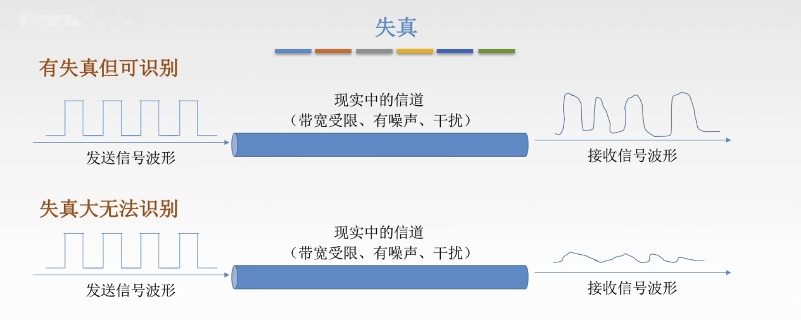

# 奈氏准则和香农定理

## 失真

 电信号在信道传输过程中的失真问题。

影响失真程度的因素：

+ 码元传输速率
+ 信号传输距离
+ 噪声干扰
+ 传输媒体质量 

失真的一种现象：`码间串扰`。接收端收到的信号波形失去了码元之间清晰界限的现象。

## 奈氏准则

在理想低通（无噪声，带宽受限）条件下，为了避免码间串扰的问题，极限码元传输速率为`2W Baud`，`W`是信道带宽码，单位是`Hz`。

极限数据率：
$$
理想低通信道下的极限数据传输率 = 2Wlog_2V (b/s)
$$

1. 在任何信道中，**码元传输的速率是有上限的**。若传输速率超过此上限，就会出现严重的码间串扰问题，使接收端对码元的完全正确识别成为不可能。
2. 信道的**频带越宽**（即能通过的信号高频分量越多），就可以用更高的速率进行码元的有效传输。
3. 奈氏准则给出了码元传输速率的限制，但并没有对信息传输速率给出限制。
4. 由于码元的传输速率收到奈氏准则的制约，索引要提高数据的传输速率，就必须设法使每个码元能携带更多个比特的信息量，这就需要采用多元制的调制方法。

## 香农定理

噪声存在于所有的电子设备和通信信道中。由于噪声随机产生，它的瞬时值有时会很大，因此噪声会使接收端对码元的判决产生错误。但是噪声的影响是相对的，若信号较强，那么噪声的影响相对较小。因此，`信噪比`就很重要。

信噪比 = 信号的平均功率/噪声的平均功率，记为S/N，并用分贝（dB）作为度量单位，即：
$$
信噪比(dB) = 10\log_{10} (S/N)
$$
香农定理：在带宽受限且有噪声的信道中，为了不产生误差，信息的数据传输速率有上限值。
$$
信道的极限数据传输速率 = W \log_2(1+S/N) (b/s)
$$

1. 信道的带宽或信道中的信噪比越大，则信息的极限传输速率就越高
2. 对一定的传输带宽和一定的信噪比，信息传输速率的上限就确定了。
3. 只要信息的传输速率低于信道的极限传输速率，就一定能找到某种方法来实现无差错的传输。
4. 香农定理得出的极限信息传输速率，实际信道能达到的传输速率要比它低不少。
5. 从香农定理可以看出，若信道带宽W或信噪比S/N没有上限（不可能），那么信道的极限信息速率也就没有上限。