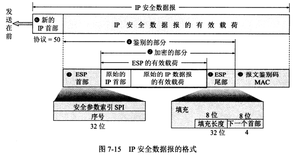
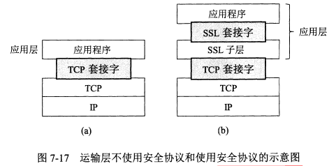
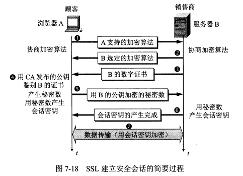

# 网络安全

## 7.1 网络安全问题概述

**7.1.1 计算机网络面临的安全性威胁**

计算机网络上的通信面临的威胁可以分为**两大类**：被动攻击（如**截获**）和主动攻击（如**中断、篡改、伪造**）。

**7.1.2 安全的计算机网络**

安全的计算机网络应该达到：**保密性、端点鉴别、信息的完整性、运行的安全性**。

**7.1.3 数据加密模型**

密码学包括密码编码学（设计密码体制）和密码分析学（破解密码）。

无条件安全的密码几乎不存在，大部分密码都是**计算上安全**的，即**在一定时间内是不可破解的**。

## 7.2 两类密码体制

**7.2.1 对称密钥密码体制**

**对称密钥密码体制**中加密密钥与解密密钥是相同的。这种加密的保密性**仅取决于对密钥的保密**，算法是公开的。

**数据加密标准 DES** 是一种对称密钥密码体制。初版的 DES 已经不安全，目前采用的是**三重 DES（3DES）**。三重 DES 广泛用于网络、金融、信用卡等系统。

**7.2.2 公钥密码体制**

**公钥密码体制**中加密密钥是公开的（**公钥**），**解密密钥是保密的（私钥）**，加密和解密算法也是公开的。

私钥是某个用户私有的，对其他人都保密。

公钥密码体制相对于对称密钥体制的**优点：**

1. 不需要考虑密钥分配问题：对称密钥需要安全地分配密钥。
2. **提供数字签名功能。**

**RSA 体制（RSA 公钥加密算法）**是最著名的公钥密码体制，它采用了数论中的**大数分解问题**。

任何加密方法的安全性取决于密钥的长度和攻破密文所需的计算量，而非体制。

## 7.3 数字签名

**数字签名需要提供三点功能：**

1. **报文鉴别**：接收者能够核实发送者对报文的签名，从而验证发送者的身份。
2. **报文的完整性**：接收者确信收到的数据和发送者发送的数据完全一样。
3. **不可否认**：发送者事后不能否认自己对报文的签名。

基于公钥密码体制数字签名功**实现方法：**发送者使用自己的私钥对一段报文进行加密，接收者使用该发送者的公钥来解密报文。

## 7.4 鉴别

鉴别是要验证通信对方是自己要通信的对象。

**7.4.1 报文鉴别**

**报文鉴别**用来鉴别报文的完整性，它采用了**密码散列函数**。

**散列函数的两个特点：**

1. 输入长度可以很长，输出长度则较短并长度固定。散列函数的输出叫做散列值。
2. 不同的散列值肯定对应不同的输入，但不同的输入可能得到相同的散列值。

密码学中的散列函数**最重要的特点是：要找到两个不同的报文具有相同的散列值，在计算上是不可行的**。也就是根据散列值来求报文的逆向变换是不可能的。

**报文摘要 MD5** 是进行报文鉴别的一种简单方法，但目前广泛使用的是**安全散列算法 SHA-2/3**。

散列函数的使用方法：对报文计算出散列值，将散列值附加在报文后面，将附加了散列值的整个报文加密进行发送。接收方解密后重新对报文计算散列值，如果与收到的散列值相同就没问题。

**7.4.2 实体鉴别**

报文鉴别对每一个收到的报文都要鉴别发送者，**实体鉴别**只需要在整个连接的过程中鉴别一次。这种不同带来了微妙的影响。

**重放攻击**

场景：A 向 B 发送带有自己身份和口令的报文，并使用对称密钥加密。B 收到报文后用对称密钥解密，鉴别 A 的身份。

但是 C 可能截获 A 发出的报文并转发给 B，这样 B 就会误认为 C 是 A，之后向 C 发送了许多本该发给 A 的报文。

**不重数法**

可以采用一个不重复使用的大随机数来解决**重放攻击**。A 向 B 发送不重数（即**不同会话使用不同的数**），这样 C 截获后再向 B 发送，B 发现收到的是重复的，就不会被骗了。

## 7.5 密钥分配

密钥分配即密钥分发，是密钥管理中最大的问题，密钥必须通过最安全的通路进行分配。

**7.5.1 对称密钥的分配**

目前常用的密钥分配方式是设立**密钥分配中心 KDC**。

**7.5.2 公钥的分配**

公钥也不可随意分配。比如 C 截获 A 发给 B 的报文（报文用 A 的私钥加密并附有 A 的公钥）再转发给 B，B 无法验证这个公钥是 A 的还是 C 的。

所以要**将公钥与对应的实体**进行绑定，由认证中心 CA 来完成此操作。

每个实体都有 CA 发来的证书，里面有公钥机器拥有者的标识信息，此证书被 CA 进行了数字签名。

任何用户都可以从可信的地方获得认证中心 CA 的公钥。

## 7.6 互联网使用的安全协议

网络层、运输层、应用层都有相应的网络安全协议。

**7.6.1 网络层安全协议**

网络层使用 **IPsec 协议族**。

VPN 就是用了网络层安全协议。

IPsec 没有规定用户必须使用哪种加密和鉴别算法，但它提供了一套加密算法。

**IP 安全数据报格式**有两个协议：包括**鉴别首部协议 AH** 和**封装安全有效载荷协议 ESP**。

1. AH 协议提供源点鉴别和数据完整性，但不能保密。
2. ESP 协议提供源点鉴别、数据完整性和保密。ESP 比 AH 复杂很多。

使用 AH 或 ESP 协议的 IP 数据报叫做 IP 安全数据报（**IPsec 数据报**）。

在 IPv6 中，AH 和 ESP 都是扩展首部的一部分。AH 协议都包含在 ESP 协议内部。

IPsec 数据报的工作方式有两种：

1. 运输方式：在整个运输层报文段的前后分别添加若干控制信息，再加上 IP 首部，构成 IPsec 数据报。
2. **隧道方式（使用最多）**：在原始的 IP 数据报的前后分别添加控制信息，再加上新的 IP 首部，构成 IPsec 数据报。

无论哪种方式，IPsec 数据报的首部都是不加密的（这样路由器才能识别首部中的信息），只有数据部分是经过加密的。

**IPsec 数据报的格式**

**7.6.2 运输层安全协议**

运输层的安全协议有**安全套接字层 SSL** 和**运输层安全 TLS**。

`SSL` 最新版本是 `SSL 3.0`，**常用的浏览器和 Web 服务器都支持 `SSL`**，`SSL` 也是 `TLS` 的基础。

`SSL` 作用于端系统应用层的 HTTP 和运输层之间，**在 TCP 之上建立起一个安全通道**，为通过 TCP 传输的应用层提供安全保障。

`TLS` 是在 `SSL3.0` 的基础上设计的。

未使用 `SSL` 时，应用层的数据通过 TCP 套接字与运输层交互，使用 `SSL` 后，中间又多了一个 `SSL` 子层。

网址中 **`https` 表示使用了 `SSL` 协议**，TCP 的 `https` 端口号是 **443**，`http` 端口号是 **80**。

`SSL` 提供的安全服务可以归纳为三种：

1. **`SSL` 服务器鉴别**，允许用户证实服务器的身份。
2. **`SSL` 客户鉴别**，允许服务器证实客户的身份。
3. **加密的 `SSL` 会话，**对客户和服务器之间发送的所有报文加密，并检测报文是否被篡改。

**`SSL` 的工作过程**

以浏览网站为例，用户点击链接建立 TCP 连接后，先进行浏览器和服务器间的握手协议，简要流程如下：

1. 协商加密算法。
2. 服务器鉴别。
3. 会话密钥计算。
4. 安全数据传输。

**7.6.3 应用层安全协议**

**PGP** 是一个完整的电子邮件安全软件包，包括加密、鉴别、电子签名、压缩等技术。PGP 没有使用新概念，只是综合了现有的加密算法。

## 7.7 系统安全:防火墙与入侵检测

**防火墙**和**入侵检测系统 IDS** 构成了系统防御的两层防线。

**7.7.1 防火墙**

防火墙是**一种特殊编程的路由器**，安装在一个网点和网络的其余部分之间，目的是**实施访问控制策略**。

防火墙内的网络称为可信的网络。

防火墙技术包括以下两类：

1. **分组过滤路由器**：它根据过滤规则（基于分组的网络层或运输层的首部信息设定）对进出内部网络的分组执行转发或丢弃。比如将所有目的端口号是 23 的进入内部网路的的分组都丢弃。
2. **应用网关**：也叫**代理服务器**。一种网络应用需要一个应用网关，万维网缓存就是一种万维网应用的代理服务器。进出网络的应用程序报文都要通过应用网关，应用网关在应用层打开报文检查是否合法。

**7.7.2 入侵检测系统**

**入侵检测系统 IDS** 是在入侵开始后及时检测到入侵以便尽快阻止。

入侵检测系统分为两种：

1. **基于特征的 IDS**：根据已知攻击的标志性特征检测入侵。
2. **基于异常的 IDS**：根据网络流量的统计特性来检测入侵。

## 7.8 一些未来的发展方向

未来的发展方向：

1. **椭圆曲线密码（ECC）与 AES**。这是下一代金融系统使用的加密系统。
2. 移动安全。移动通信所需要的。
3. 量子密码。

## 7.9 网关

网关（Gateway） 是网络通信中的一个关键设备或系统，用于连接两个 不同协议、不同架构或不同网络环境 的网络，实现它们之间的数据转发与协议转换 。

> **“网关 = 不同网络之间的桥梁”** 

你可以把它想象成：

- 一座连接两岸的桥
- 一个翻译官，能将一种语言（协议）翻译成另一种语言
- 一个中转站，负责路由和转换信息

| 层级       | 设备                        | 功能                             |
| ---------- | --------------------------- | -------------------------------- |
| 应用层     | 网关（Application Gateway） | 处理特定应用协议（如 HTTP、FTP） |
| 传输层     | 网关                        | 协议转换（如 TCP ↔ UDP）         |
| 网络层     | 路由器（可作为网关）        | IP 地址转发、路由选择            |
| 数据链路层 | 网桥/交换机                 | MAC 地址转发                     |

