## 网络层

计算机网络中，**网络层（Network Layer）** 是 `OSI` 七层模型中的第三层，其主要职责是负责将数据从源主机传输到目的主机，尤其是在不同网络之间进行路由选择和转发。在 `TCP/IP` 模型中，网络层也被称为 **网际层（Internet Layer）**，例如 `IP` 协议就位于这一层。

**网络层的主要职责包括**：

1. 路由选择（Routing）

- 决定数据包从源到目的地的路径。
- 使用路由算法和路由表来选择最佳路径。
- 路由器工作在网络层，负责跨网络的数据转发。

2. 逻辑寻址（Logical Addressing）

- 为每台设备分配逻辑地址（如 `IPv4` 地址或 `IPv6` 地址），以唯一标识网络中的主机。
- 常见协议：`IP`（Internet Protocol）、`IPX`（旧用）等。

3. 数据包转发（Packet Forwarding）

- 将数据包从一个节点传送到下一个节点，直到到达目标。
- 每个路由器根据目的地址查找路由表决定下一跳。

4. 分组与重组（Packetization and Reassembly）

- 如果数据太大，网络层可能对上层的数据进行分片（如 `IPv4` 的分片机制）。
- 在接收端重新组装这些分片（注意：`IPv6` 中一般不允许中间节点分片，由发送端处理）。

5. 拥塞控制（Congestion Control）

- 部分网络层协议参与检测和缓解网络拥塞，避免网络性能下降。

6. 异构网络互联（Internetworking）

## 4.1 网络层提供的两种服务

网络层提供的服务可以是”**面向连接**“的或是”**无连接**“的服务。

:::info

什么是面向连接和无连接?

一、基本概念
1. 面向连接（Connection-Oriented）
在发送数据前，需要先建立一个逻辑或物理的“连接”。
连接建立后，所有数据都沿着这个路径传输。
类似于打电话：先拨号建立连接，再说话，最后挂断。
例子 ：X.25、帧中继（Frame Relay）、ATM 等早期网络协议采用这种方式。 

2. 无连接（Connectionless）
不需要事先建立连接，直接发送数据包。
每个数据包独立选择路由路径到达目的地。
类似于寄信：每封信自己带地址，邮局根据地址转发，不保证顺序和可靠性。

:::

用于打电话的传统电信网使用面向连接的通信方式，它先建立连接预留出网络资源（建立一条虚电路），然后再传送信息，提供的是可靠传输的服务。

互联网采用的是**无连接**的方式，发送分组时不需要建立连接。

网络层向上只提供简单灵活的、无连接的、尽最大努力交付的数据报服务。这样使造价降低，运行灵活。

## 4.2 网际协议`IP`

这里的 `IP` 是 `IP` 协议的第 4 个版本，实际叫做 `IPv4`。较新的还有 `IPv6`。

与 `IP` 协议配套的还有三个协议：

1. **地址解析协议 ARP**
2. **网际控制报文协议 ICMP**
3. **网际组管理协议 IGMP**

#### 4.2.1 虚拟互连网络

不同网络的区别很大，因为没有一种单一的网络能够适应所有用户的需求。因此需要通过一些**中间设备**将网络连接起来。

**根据所在层次，可以将中间设备分为以下四种：**

1. 物理层使用的叫**转发器**。
2. 数据链路层使用的叫**网桥或桥接器**。
3. 网络层使用的叫**路由器**。
4. 网络层以上使用的叫网关。

在物理层使用转发器或在数据链路层使用网桥时，仅是把一个网络扩大了。从网络层看，这还是一个网络，不是网络互连。

**网络互连是在网络层通过路由器实现的。**

都使用 `IP` 协议的网络互连以后叫虚拟互连网络，含义是这些在物理层面不同的网络在网络层看起来好像是一个统一的网络，又叫 **IP 网**。

现在的互联网就是使用了 `IP` 协议和 `TCP` 协议。

#### 4.2.2 分类的IP地址

**`IP` 地址及其表示方法**

整个互联网就是一个单一的、抽象的网络。

`IP` 地址就是给互联网上每一台主机或路由器的**每一个接口**分配一个全世界`唯一的 `32 位的标识符。

`IP` 地址的编址方法经历了三个阶段：

1. **分类的 `IP` 地址。**
2. **子网的划分。**
3. **构成超网。**

分类的 `IP` 地址就是讲 `IP` 地址划分为多个固定类，每一类地址由**两个固定长度的字段组成**。

1. 第一个字段是**网络号**，标志主机所连接到的网络，一个网络号在整个互联网范围内是唯一的。
2. 第二个字段是**主机号**，标志该主机（或路由器），一个主机号在该网络号所指明的网络范围内是唯一的。

**IP 地址 = {<网络号>，<主机号>}**，它既指明了主机接口，也指明了所在网络。

分类的`IP` 地址分为以下 5 类：

1. A 类、B 类、C 类都是单播地址，是最常用的。
2. D 类是用于多播（一对多通信）。
3. E 类地址保留为以后用。

分类是考虑到了不同网络间的差异性，有的网络主机很多，有的则很少。
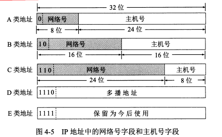

现在广泛使用**无分类 `IP` 地址**进行路由选择，分类的地址已经成为历史。

`IP` 地址是 4 字节共 32 位字符，平常电脑上显示的是每个字节按转化为 10 进制后的结果，称为**点分十进制法**。

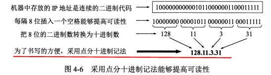

**`IP` 地址有以下几个特点：**

1. 每一个 `IP` 地址都是由网络号和主机号两部分组成，是一种分等级的地址结构。这种结构有几个优点

2. 1. `IP` 地址管理机构在分配 `IP` 地址时只分配网络号，而主机号由得到网络号的单位内部自行分配。
   2. 路由器仅根据目的主机所连接的网络号来转发分组而不考虑主机号。这使路由表中的项目数大幅减少，减小了路由表的存储空间和查找时间。

3. `IP` 地址是标志一台主机（或路由器）和一条链路的接口。如果一台主机同时连接到两个网络，它就有两个 `IP` 地址。

4. 1. 每个路由器至少连接到两个网络，所以一个路由器至少有两个不同的 `IP` 地址。

5. 互联网中，一个网络指的是具有相同网络号的主机的集合。所以用转发器或网桥连接起来的若干局域网仍是一个网络。

6. `IP` 地址中，所有分配到网络号的网络都是平等的，不管它的范围多大或多小。

#### 4.2.3 `IP`地址与硬件地址

硬件地址（又称物理地址、MAC地址）是数据链路层和物理层使用的地址。MAC帧传送时使用的源地址和目的地址都属于硬件地址，放在 MAC 帧的首部。

**`IP` 地址**是网络层和以上各层使用的地址，是一种**逻辑地址**。放在 `IP` 数据报的首部。

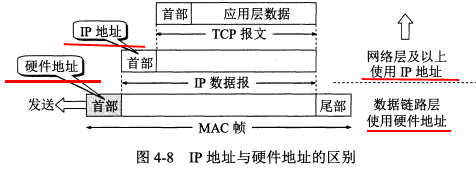

下面是三个局域网通过两个路由器连接在一起，主机 H1 要与主机 H2 通信。

路由器因为同时连在两个局域网上，所以有两个硬件地址。

注意：

1. 在 IP 层抽象的互联网上只能看到 IP 数据报。虽然信息要经过路由器 R1 和 R2 的转发，但是 **IP 报首部中的源地址和目的地址始终是 IP1 和 IP2。**
2. 虽然 IP 数据报首部有源地址，路由器只根据目的站的 IP 地址的网络号进行选择。
3. 在局域网的链路层，只能看见 MAC 帧。**MAC 帧在不同网络上传送时，MAC 帧首部中的源地址和目的地址要发生变化。**
4. IP 层抽象的互联网屏蔽了下层的复杂细节。只要在网络层上，就可以使用统一的、抽象的 IP 地址来研究主机和主机间的通信。

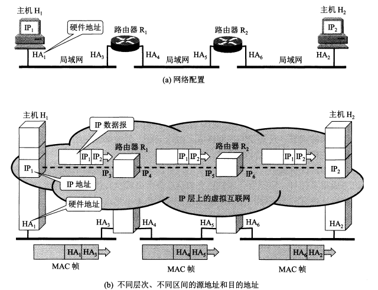

#### 4.2.4 地址解析协议`ARP`

网络层用的是 IP 地址，但实际网络的链路上传送数据帧时还是要用硬件地址。当数据传到不同网络时，MAC 帧中的硬件地址还会发生改变，主机或路由器怎么知道该在 MAC 帧的首部中填入什么硬件地址呢？

**ARP 协议**的用途是从网络层使用的 IP 地址解析出数据链路层使用的硬件地址。

根据地址解析协议 ARP，每台主机都有一个 **ARP 高速缓存**，里面有本局域网上的各主机和路由器的 IP 地址到硬件地址的映射表。

主机的硬件地址可能会发生改变，因此该映射表会时常更新，映射表中的每个项目都有生存时间，超过生存时间的项目会被删掉。

**当主机 A 向本局域网上的主机 B 发送 IP 数据报时有两种情况：**

1. 主机 A 的 ARP 高速缓存的映射表中有主机 B 的 IP 地址，就把对应的硬件地址写入 MAC 帧，然后通过局域网把该 MAC 帧发给此硬件地址。

2. 主机 A 的 ARP 高速缓存中没有 B 的 IP 地址。此时按以下步骤找出 B 的硬件地址：

3. 1. 主机 A 自动运行 ARP 进程，ARP 进程在本局域网上广播发送一个 **ARP 请求分组**。分组中指明了**自己的 IP 地址与硬件地址，和主机 B 的 IP 地址。**
   2. 本局域网上所有主机上运行的 ARP 进程都受到这个 ARP 请求分组。
   3. 主机 B 的 IP 地址与 ARP 请求分组中要查询的 IP 地址一致，收下分组，并向主机 A 发送响应分组，在其中写入自己的硬件地址。其他主机则不作响应。
   4. 主机 A 收到主机 B 的响应分组后，把主机 B 的 IP 地址到硬件地址的映射写入 ARP 高速缓存中。

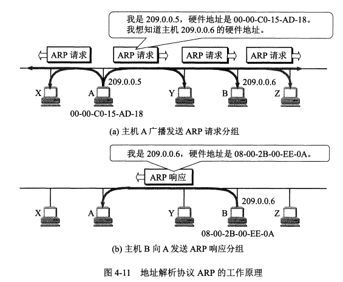

ARP 解决的是**同一个局域网上**主机或路由器的 IP 地址到硬件地址的映射问题。它无法解析另一个局域网上主机的硬件地址，实际上也不用。

**使用 ARP 的四种典型情况**

1. 发送方是主机，要把 IP 报发到同一个网络上的另一台主机，如从 H1 到 H2，这时 H1 发送 ARP 请求分组（在网 1 上广播）找到 H2 的硬件地址。
2. 发送方是主机，要把 IP 报发到另一个网络上的某一台主机，如从 H1 到 H3，这时 H1 发送 ARP 请求分组（在网 1 上广播）找到网 1 上的一个路由器 R1 的硬件地址。剩下的事情由 R1 完成。
3. 发送方是路由器，要把 IP 报转发到与它连接在同一个网络上的主机，如 R1 到 H2，这时 R1 发送 ARP 请求分组（在网 2 上广播）找到主机 H3 的硬件地址。
4. 发送方是路由器，要把 IP 报转发到另一个网络上的一台主机，如 R1 到 H3，这时这时 R1 发送 ARP 请求分组（在网 2 上广播）找到本网络上另一个路由器的硬件地址。

总的来说，当发送方与接收方不在同一个网络时，要通过同时位于两个或更多个网络上的路由器来中转，而 ARP 协议则用于每个局域网内部的地址解析。

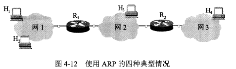

**4.2.5 IP数据报的格式**

一个 IP 数据报的**首部包括两部分**，前一部分是固定长度，共 20 字节。后面是一些可选字段，长度可变。

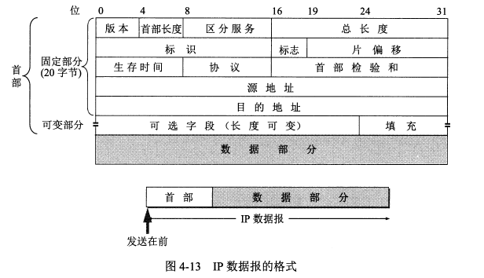

**IP 数据报首部的固定部分的各字段**

1. 版本。占 4 位，通信双方使用的 IP 协议的版本必须一致。
2. **首部长度。** 占 4 位，最大值是 15，注意其单位是 4 字节，也就是首部最大长度为 15*4=60 字节。首部长度必须是 4 字节的整数倍。因此可选字段后面还有一个填充字段。
3. 区分服务。占 8 位，一般不使用，只有使用**区分服务 DiffServ** 时此字段才有意义，根据字段的数值为提供不同等级的服务质量。
4. **总长度。**占 16 位，最大值是 65535，是首部和数据部分的长度和，单位是字节。IP 数据报的长度还受到 MAC 帧最大长度的限制，因此不能太大。如果长度过长需要进行分片。分片后总长度指的是该分片的首部长度和数据长度之和。
5. **标识。** 占 16 位。同一个数据报的不同分片标识相同。因此接收方能根据标识将不同分片重装为原本的数据报。
6. **标志。**占 3 位。最低位为 1 表示后面还有分片，为 0 表示这是最后一个分片。中间位为 1 表示不能分片，为 0 表示可以分片。首位没有含义。
7. **片偏移。**占 13 位。片偏移指出：较长的分组分片后，某片在原分组的相对位置。单位是 8 字节，故每个分片的长度是 8 字节的整数倍。
8. **生存时间**。占 8 位。表明数据报在网络中的寿命。单位是跳数，指明了数据报在互联网中至多可经过多少个路由器。
9. **协议。**占 8 位。指明了数据报携带的数据使用了哪种协议。
10. **首部检验和。**占 16 位。这个字段只检验首部，不包括数据部分。数据报每经过一个路由器，路由器就要重新计算一下首部检验和。
11. 源地址。占 32 位。
12. 目的地址。占 32 位。

**IP 数据报首部的可变部分**

长度可变，具有多种功能，但很少使用。IPv6 已经把这部分做成固定长度的了。

**4.2.6 `IP`层转发分组的流程**

路由器的路由表中不直接存储主机地址，而是**存储目的网络的地址和对应下一跳的地址。**

路由表中并没有指明完整的网络路径，仅指出要想到达某个网络，需要先到哪个路由器，即仅指出下一步该怎么走。这样一跳一跳直到最后到达目的网络。

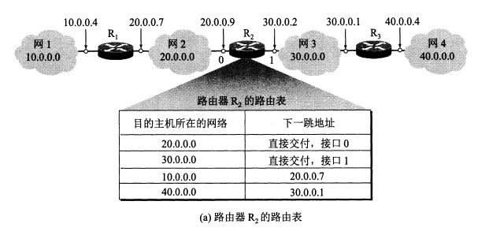

**分组转发算法如下：**

1. 从数据报的首部提取出目的主机的 IP 地址 D，得出目的网络地址为 N。
2. 若 N 就是与此路由器直接相连的某个网络地址，就直接交付，即直接把数据报交付目的主机；否则就是间接交付，执行 3。
3. 若路由表中有目的地址为 D 的特定主机路由，则把数据报传送给路由表中所指明的下一跳路由器。否则执行 4。
4. 若路由表中有到达网络 N 的路由，则把数据报传送给路由表所指明的下一跳路由器，否则执行 5。
5. 若路由表有一个默认路由，则把数据报传送给路由表所指明的默认路由器，否则执行 6。
6. 报告转发分组出错。

## 4.3 划分子网和构造超网

**4.3.1 划分子网**

之前是两级 IP 地址，缺点很多。后在 IP 地址中又增加了一个子网号字段，将 IP 地址分为了三级。

划分子网是把 IP 地址的主机号再划分，未改变网络号。

**子网掩码**

划分子网后，IP 数据报的首部无法体现是否进行了划分。需要使用**子网掩码**。

现在的互联网规定所有的网络都必须使用子网掩码，**路由器的路由表中也必须有子网掩码这一栏。**

路由器在和相邻路由器交换信息时，必须把自己所在子网的子网掩码告诉对方。

**4.3.2 使用子网时分组的转发**

使用子网划分后，路由表中必须包含目的网络地址、子网掩码和下一跳地址三项内容。

此时的分组转发算法如下：

1. 从数据报的首部提取出目的主机的 IP 地址 D。

2. 判断是否为直接交付。对路由器直接相连的网络逐个检查：用各网络的子网掩码逐个与 D 按位相与，看结果是否和相应的网络地址匹配。若匹配，就直接交付；否则就是间接交付，执行 3。

3. 若路由表中有目的地址为 D 的特定主机路由，则把数据报传送给路由表中所指明的下一跳路由器。否则执行 4。

4. 对路由表中的每一行，用其中的子网掩码和 D 逐位相与，若结果与该行的**目的网络地址**匹配，则把数据报传送给该行指明的下一跳路由器，否则执行 5。

5. 若路由表有一个默认路由，则把数据报传送给路由表所指明的默认路由器，否则执行 6。

6. 报告转发分组出错。

   

**4.3.3 无分类编址CIDR(构造超网)**

**无分类编址**全名**无分类域间路由选择 CIDR****。**

**CIDR 有两个主要特点：**

1. CIDR 消除了传统的 A,B,C 类地址和划分子网的概念，它把 32 位的 IP 地址分为前后两部分。“前缀”用来指明网络，后面部分用来指明主机。因此它使用的是两级编址，但是是**无分类的两级编址。**
2. CIDR 把前缀都相同的连续的 IP 地址组成一个 CIDR 地址块，只要知道该地址块中的任意一个地址，就可以知道地址块的起始地址、最大地址和地址块中的地址数。

CIDR 使用 32 位的地址掩码，地址掩码中 1 的个数对应的就是前缀的长度。前缀越短，其地址块包含的地址数越多。

使用 CIDR 可以更有效地分配地址空间。

**最长前缀匹配**

CIDR 中，路由表的每个项目由网络前缀和下一跳地址组成，查找时可能得到不止一个匹配结果。这是从匹配结果中选择具有最长网络前缀的路由，因为它对应的地址块最小。

**使用二叉线索从查找路由表**

无分类编址的路由表通常存放在一个**二叉线索树**中。

下图的二叉线索树表示了一个有 5 个 IP 地址的路由表。树的每一层对应 IP 地址中的一位，树最多有 32 层。

给定一个 IP 地址，查找它是否在该项目表中，只需在二叉线索树中一层层对应向下寻找，若中间无法在二叉树中找到对应分支，表明这个地址不在这个二叉线索中。

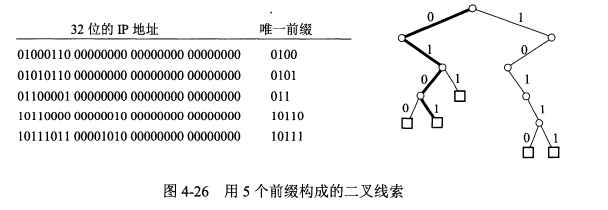

## 4.4 网际控制报文协议ICMP

**网际控制报文协议 ICMP** 用于更有效地转发 IP 数据报和提高交付成功的机会。

ICMP 报文装在 IP 数据报中，作为其中的数据部分。

ICMP 报文的首部共 8 个字节，具体如下图。

其中检验和字段用来检验整个 ICMP 报文。

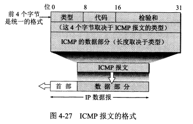

**4.4.1 ICMP报文的种类**

ICMP 报文包括 **ICMP 差错报告报文**和 **ICMP 询问报文**两类，每类下细分为几种不同的类型。

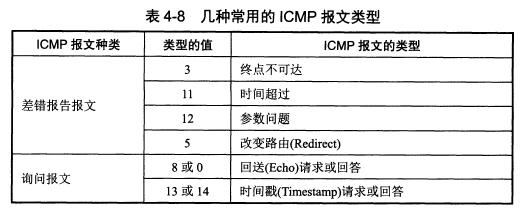

表中给出了 4 种常用的 ICMP 差错报告报文：

1. **终点不可达**：当路由器或主机不能交付数据报时就向源点发送此报文。
2. **时间超过**：路由器收到生存时间为 0 的报文时，除丢弃该数据报外，还要向源点发送此报文。当终点在约定时间内未收到一个数据报的全部分片时，就丢弃已收到的所有分片，并向源点发送此报文。
3. **参数问题**：当路由器或目的主机收到的数据报的首部中有的字段值不正确时，就丢弃该数据报并发送此报文。
4. **改变路由（重定向）：**路由器把此报文发送给主机，以告诉主机下次将数据报发给另外的路由器。

另外 2 种常用的 ICMP 询问报文：

1. **回送请求报文和回答报文：**回送请求报文是由主机或路由器向一个特定目的主机发出的询问。收到此报文的主机必须给源主机发送 ICMP 回送回答报文。
2. **时间戳请求报文和回答报文**：时间戳请求报文是请某台主机或路由器回答当前的日期和时间。通过它可以进行时钟同步和时间测量。

ICMP 差错报告报文的**数据字段是固定格式**的：把收到的需要进行差错报告的 IP 数据报的首部和数据字段的前 8 个字节（为了得到运输层的端口号和运输层报文的发送序号）提取出来作为 ICMP 报文的数据部分。

**4.4.2 ICMP的应用举例**

**PING**

ICMP 的一个重要应用是进行**分组网间探测 PING（Packet InterNet Groper）**，以测试两台主机之间的连通性。

PING 使用了 ICMP 回送请求和回送回答报文。它会连续发送 4 条回送请求报文。

PING 是应用层直接使用 ICMP 的例子，未经过运输层。

**使用方法**：在 Windows 的 Dos 窗口中键入 **ping hostname** 即可测试本机与主机 hostname 之间的连通性，hostname 应该是某个主机的 IP 地址或域名

​                 ping www.baidu.com;//测试与百度之间的连通性 ping 192.168.100.5;//测试与 IP 地址为 192.168.100.5 的之间的连通性               

**tracert**

**tracert** 可以用来跟踪一个分组从源点到终点的路径。

tracert 从源主机向目的主机发送一连串的 IP 数据报。数据报中封装的是**无法交付的 UDP 用户数据报**。

这些数据报中，第一个数据报的生存时间 TTL 设为 1，后面依次增长。当第 i 个数据报到达了路径上的第 i 个路由器，其 TTL 也减到了 0，此时该路由器就会发送 ICMP 时间超过差错报告报文给源主机。由此就可以获得到达目的主机所经过的所有路由器的 IP 地址，以及到达每一个路由器的往返时间。

**使用方法：**在 Windows 的 Dos 窗口中键入 **tracert hostname** 即可测试本机到主机 hostname 所经过的路由器。

## 4.5 互联网的路由选择协议

**4.5.1 有关路由选择协议的几个基本概念**

**路由选择协议的核心**是采用何种算法来获得路由表中的各项目。

路由选择算法可以分为静态路由选择策略和动态路由选择策略。

其中动态的可以较好地使用网络状态的变化，但实现起来较复杂，适用于大网络。互联网采用的主要是**动态的、分层次的路由选择协议**。

**分层次的路由选择协议**

互联网被划分为许多小的自治系统（AS），一个 AS 是在单一技术管理下的一组路由器，一个 AS 对另一个 AS 表现出的是一个单一的和一致的路由选择策略。目前互联网中，一个大的 ISP 就是一个 AS。也可以进一步划分。

这样互联网就把路由选择协议分为了两类：

1. **内部网关协议 IGP：**如 **RIP** 和 **OSPF** 协议，是在一个 AS 内部使用的路由选择协议。每个 AS 自己决定在自己内部使用哪一种 IGP。
2. **外部网关协议 EGP**：如 **BGP-4** 协议，用在两个不同的 AS 之间的路由选择协议。每个 AS 中位于与其他 AS 交界处的路由器除了使用 IGP 外还要使用 EGP。

**4.5.2 内部网关协议RIP**

RIP 是一种**分布式的基于距离向量的路由选择协议**，最大优点是简单。

RIP 协议要求每一个路由器都要维护从它自己到其他每一个目的网络的距离记录，距离的单位是跳数。**RIP 选择一条具有最少路由器的路径。**

RIP 允许一条路径最多有 15 个路由器，因此 RIP 只适用于小型互联网。

RIP 和 OSPF 同为分布式路由选择协议，特点是**每一个路由器都要不断地和其他路由器交换路由信息。**

**RIP 的特点是：**

1. 仅和相邻路由器交换信息。
2. 交换的信息是当前本路由器知道的所有信息，即自己的路由表。
3. 按固定的时间间隔交换路由信息，比如 30s。

路由器刚开始的路由表是空的，通过不断地和与它直接相连的路由器交换并更新信息，经过多次更新后，所有的路由表就都会知道到达本自治系统中任何一个网络的最短距离和下一跳路由器的地址了。

路由表中最主要的信息就是**到某个网络的最短距离和下一跳地址**。

**4.5.3 内部网关协议OSPF**

OSPF 是分布式的链路状态协议，适用于大型互联网。OSPF 只**在链路状态发生变化时**，才向本自治系统中的所有路由器**用洪泛法**发送**与本路由器相邻的所有路由器的链路状态信息**。

链路状态指明本路由器和哪些路由器相邻，以及该链路的度量（度量可表示费用、距离、时延、带宽等），所有的路由器最终都能建立一个全网的拓扑结构图。

**4.5.4 外部网关协议BGP**

**BGP** 是 **BGP-4** 的简写。BGP 是**不同 AS 的路由器之间**交换路由信息的协议，是一种路径向量路由选择协议。BGP 力求寻找一条能够到达目的网络**（可达）**且比较好的路由**（不兜圈子）**，而非寻找最佳路由。

**4.5.5 路由器的构成**

## 4.6 IPv6

IPv4 的地址已经耗尽。

IPv6目前尚未推出标准协议。

**4.6.1 IPv6的基本首部**

IPv6 将**协议数据单元 PDU** 称为**分组**，而非 IP 数据报。

**IPv6 的主要变化：**

1. 更大的地址空间：地址位数增大到了 128 位。
2. 扩展的地址层次结构：因为地址空间很大，所以可以划分更多层。
3. 灵活的首部格式：IPv6 的首部和 IPv4 的首部不兼容。
4. 改进的选项。IPv6 的首部长度是固定的，把选项放在了有效载荷中。
5. 允许协议继续扩充。
6. **支持自动配置，也就是不需要 DHCP 协议**。
7. 支持资源的预分配。
8. 首部改为 8 字节对齐：即首部长度应为 8 字节的整数倍。

IPv6 数据报分为基本首部和有效载荷。有效载荷中允许有 0 个或多个**扩展首部**。注意扩展首部不属于首部。

IPv6 的首部包括：

1. 版本。
2. 通信量类。
3. 流标号。
4. 有效载荷长度。
5. 下一个首部。
6. 跳数限制。等同于 TTL。
7. 源地址。
8. 目的地址。

**4.6.2 IPv6的地址**

IPv6 数据报的目的地址可以是以下三种之一：

1. **单播**：点对点通信。
2. **多播**：一点对多点的通信。
3. **任播：**任播的终点是一组计算机，但是数据报只交付其中一个，一般是最近的一个。

IPv6 地址有 128 位，采用**冒号十六进制计法**：每 16 位用 16 进制表示并用冒号隔开，因此共分为了 8 段，每段是一个不超过 4 位的 16进制数。

**4.6.3 从IPv4向IPv6过渡**

两种从 IPv4 向 IPv6 过渡的策略：**双协议栈**和**隧道技术**。

**双协议栈**

双协议栈即使一部分主机或路由器装有**双协议栈：一个 IPv4 和一个 IPv6**，当它与 IPv6 主机通信时使用 IPv6 地址，与 IPv4 主机通信时使用 IPv4 地址。

双协议栈**使用域名系统 DNS 来查询目的主机使用哪一种地址**。

**隧道技术**

当源主机和目的主机都采用 IPv6 时，中间经过的网络有可能是 IPv4 网络。

在 IPv6 数据报要进入 IPv4 网络时，把 IPv6 数据报作为数据部分封装到 IPv4 数据报中，等离开 IPv4 网络后在把数据部分取出来。

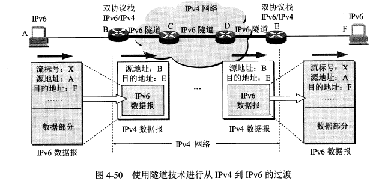

**4.6.4 ICMPv6**

**ICMPv6** 是应用于 IPv6 的 ICMP 协议版本，比 ICMPv4 复杂很多，**地址解析协议 ARP 和网际组管理协议 IGMP 的功能都合并到了 ICMPv6 中**。

ICMPv6 是面向报文的协议，利用报文来报告差错、获取信息。

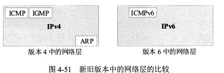

## 4.7 IP多播

**4.7.1 IP多播的基本概念**

在一对多的通信中，多播可以比单播节省很多资源。

**局域网具有硬件多播功能**，所以不需要复制分组就能使所有的多播组成员收到分组。

IP 多播所传送的分组需要使用多播 IP 地址。在传统的 IP 地址中的 D 类地址就是多播地址，每个 D 类地址可以标识一个**多播组**。

多台主机可以**加入到一个多播组中共享一个多播地址**。不同网络的主机可以加入到同一个多播组中。**每一台主机可以随时加入或离开一个多播组。**

能够运行多播协议的路由器为多播路由器。

**多播地址只能用于目的地址**，不能用于源地址。

IP 多播有两种

1. 在本局域网上硬件多播。
2. 在互联网范围内进行多播。

**4.7.2 在局域网上进行硬件多播**

多播 IP 地址与以太网硬件地址之间有映射关系，但不是一一对应的。收到多播数据报的主机需要在 IP 层进行过滤。

**4.7.3 网际组管理协议IGMP和多播路由选择协议**

**IGMP** 协议用于让连接在本地局域网上的多播路由器知道本局域网上是否有主机参加或退出了某个多播组。IGMP 工作在单个本地局域网内部。

因为主机随时可能加入或退出某个多播组。并且发送多播数据报的主机可以位于多播组内，也可以不位于多播组内。所以 IP 多播很复杂。

**IGMP 协议的工作内容：**

1. 当某台主机加入某个多播组时，该主机向多播组的多播地址发送一个 IGMP 报文，声明自己成为了该组的成员。本地的多播路由器收到 IGMP 报文后还要转发给其他多播路由器。
2. 组成员关系是动态的。本地多播路由器要周期性地探询本地局域网上的主机是否还是组的成员。

**多播路由选择协议**

多播路由选择协议有多种，尚未进行标准化。

多播路由选择协议在转发多播数据报时有以下三种方法：

1. 洪泛与剪除。
2. 隧道技术。
3. 基于核心的发现技术。

目前的多播路由选择协议：

1. 距离向量多播路由选择协议 DVMRP
2. 基于核心的转发树 CBT
3. 开放最短通路优先的多播扩展 MOSPF
4. 协议无关多播-稀疏方式 PIM-SM

## 4.8 虚拟专用网VPN和网络地址转换NAT

**4.8.1 虚拟专用网VPN**

因为 IP 地址的紧缺。所以现在使用了一种**“本地地址”**。**本地地址仅在本机构内部有效**，不是全球唯一的地址，又称**可重用地址**。

本地地址只能用于一个机构的内部通信，不能和互联网行的主机通信。互联网中的所有路由器对目的地址是**专用地址**的数据报一律不转发。

IPv4 标准指明了以下地址为**专用地址**，他们只能作为本地地址用于机构内部的通信：

1. **10.0.0.0-10.255.255.255**
2. **172.16.0.0-172.31.255.255**
3. **192.168.0.0-192.168.255.255**

采用专用地址的网络称为专用互联网或**本地互联网**。

有时一个机构的分布范围很广，就需要用公共的互联网作为**本机构各专用网之间的通信载体**，这样的称为**虚拟专用网 VPN**。

VPN 依然只用于机构内的通信，但是要经过公用的互联网，通过互联网传送的数据都要加密。这里使用了隧道技术。

VPN 中每个不同的场所必须至少有一个合法的全球 IP 地址。

VPN 代理就是依托 VPN 技术进行的。

**4.8.2 网络地址转换NAT**

**网络地址转换 NAT** 用于实现专用网中的主机到互联网上的主机的通信。

它需要在专用网连接到互联网的路由器上安装 NAT 软件，这种路由器称为 NAT 路由器，**NAT 路由器至少有一个全球地址。**

使用本地地址的主机和外界通信时要在 NAT 路由器上将本地地址转换为全球地址。

**NAT 路由器中有一个地址转换表**，存储本地地址与转换后的全球地址的对应关系。

通过 NAT 路由器的通信必须由专用网内的主机发起，因此**专用网内的主机不能作为服务器**。

现在的 NAT 转换表把端口号也利用上了。这样 NAT 路由器只需要有一个全球地址，通过给具有不同本地地址的主机分配不同的端口号就可以实现内部多个主机与外界互联网的通信。

## 4.9 多协议标记交换MPLS